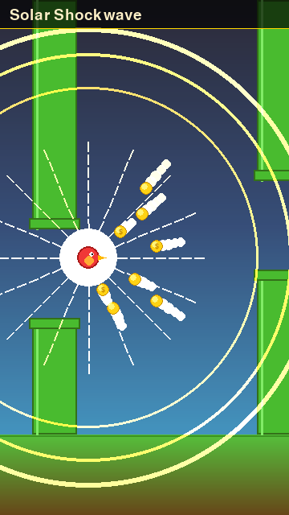
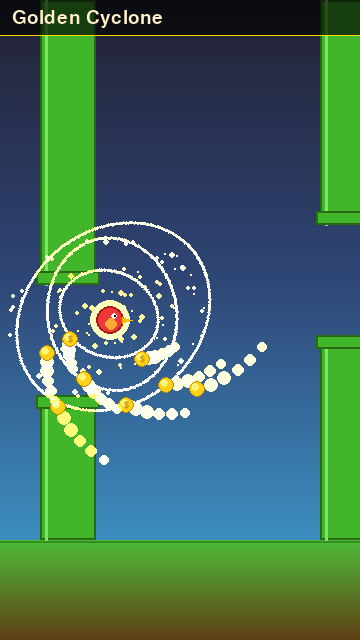
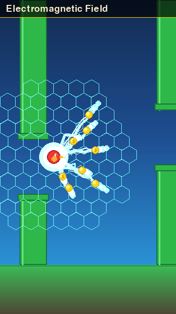
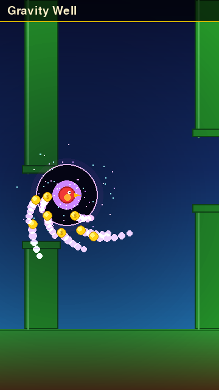
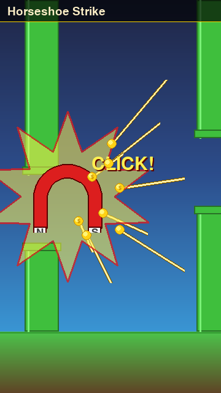
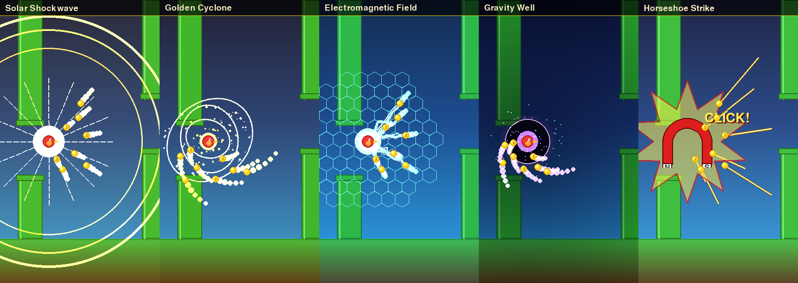

# Mega Magnet — activation-effect designs

Five candidate on-activation visuals for the **Mega Magnet** powerup.

## Existing mechanic (unchanged)

The "Mega Magnet" is the internal `vacuum` powerup (secret late-game,
gated at score ≥ 500). On pickup it snapshots every uncollected coin on
screen and lerps each one to the bird over `VACUUM_TRAVEL_TIME = 0.4 s`,
firing `_on_coin` per arrival so score / triple / proof chain all flow
normally. Source: `game/world.py:1262` (`_activate_vacuum`).

These mockups only change **what the screen does during those 0.4 s**.
The current pickup is just a 32-particle burst + the same tornado icon
the world spawns — readable, but the moment doesn't feel "mega".

## Designs

All five hero shots are rendered at the real game viewport (360×640).
Coins are mid-pull (≈ t=0.55). Each design has a 4-frame motion strip
(t = 0.00 → 0.33 → 0.66 → 1.00) showing the arc.

### 1. Solar Shockwave — radial pulse + sun-ray spokes

Three nested gold shockwave rings expand from the bird outward to the
screen edge, staggered by ~0.12 s so a viewer sees a triple-pulse
rhythm. 16 radial sun-ray spokes fade in beneath the rings. Coins
travel straight-line with short gold-line trails. Bright cream-white
flash core on the bird.

* **Palette:** solar gold + cream + white (rhymes with the existing
  regular Magnet aura — feels like its "evolved" form).
* **Reads as:** authority / power surge.
* **Pros:** strongest "wow" without being chaotic; sympathetic to the
  warm-amber regular Magnet so the two powerups share family DNA.
* **Cons:** rings can fight visually with Coin Rush gold formations
  occurring under it.


Motion strip: `01_solar_shockwave_strip.png`

### 2. Golden Cyclone — spiraling tornado funnel

Three nested swirling particle bands + three rotating elliptical funnel
rings centred on the bird. Coins follow **curving** spiral paths inward
(not straight lines) — they pirouette before landing. Continues the
tornado motif of the existing in-world `vacuum` icon, but bigger.

* **Palette:** amber → gold → cream gradient.
* **Reads as:** suction / vortex.
* **Pros:** evolves the icon language already in the game; coin paths
  are visibly different from the regular Magnet's gentle radial tug,
  signalling "this is the *big* one".
* **Cons:** lots of small particles — risk of pixel noise on the
  pygbag/WASM target where blits are expensive.


Motion strip: `02_golden_cyclone_strip.png`

### 3. Electromagnetic Field — sci-fi lightning bolts

Cyan-white jagged lightning bolts arc from the bird to **each coin
individually**, with a faint hexagonal field grid revealed behind the
bird. Coins follow straight-line paths along the bolt; brief
ozone-blue screen wash.

* **Palette:** electric cyan + ice-white + deep blue.
* **Reads as:** electromagnet / tech.
* **Pros:** most distinct from the regular Magnet's warm aura — no
  palette confusion. Lightning-per-coin makes the *individual-coin*
  pull explicit, which the linear-snap mechanic actually is.
* **Cons:** cyan is also the Slow-Mo accent colour; need to verify it
  doesn't feel like a Slow-Mo variant. Hex grid is fussy at 360-wide.


Motion strip: `03_electromagnetic_field_strip.png`

### 4. Gravity Well — cosmic implosion with orbital decay

Dark purple-blue accretion disc forms at the bird with a bright
magenta-cyan corona ring. Coins follow tight **orbital-decay** spirals
(faster rotation, sharper inward pull than Cyclone). Brief screen-edge
vignette focuses attention. Magenta tracer dots imply orbiting matter.

* **Palette:** violet + magenta + cyan corona (the only "cool, dark"
  variant — fully different from every other powerup's signature).
* **Reads as:** cosmic / black-hole.
* **Pros:** most cinematic; the vignette + dark disc give the moment
  real *weight*, which is appropriate for a score-500+ secret reveal.
* **Cons:** darkens a chunk of screen mid-flight, which can mask a
  pillar edge for ~0.4 s. Need to verify play-feel doesn't suffer.


Motion strip: `04_gravity_well_strip.png`

### 5. Horseshoe Strike — cartoony classic-magnet stamp

A giant red-and-white horseshoe magnet drops in from above, settles on
the bird at ~2× scale and pulses red/white once. Bold gold "speed line"
streaks from each coin's start to the bird. Comic-style 20-point
starburst behind it. "CLICK!" word marker.

* **Palette:** signature red + white + gold (matches the in-world
  magnet pickup icon, which is already a red horseshoe).
* **Reads as:** "magnet!" instantly — most legible.
* **Pros:** zero ambiguity; lowest learning cost for new players;
  brand-consistent with the pickup-sprite they just grabbed. Plays the
  comic-book card the other 4 don't.
* **Cons:** tonally lighter than the rest of the game's polish — risk
  of feeling like a different art project. Big overlay covers the bird
  briefly, which costs ~0.2 s of pillar visibility.


Motion strip: `05_horseshoe_strike_strip.png`

## Side-by-side



## Inspiration sources

Surveyed before drafting the five concepts:

* [Coin Magnet — Subway Surfers Wiki](https://subwaysurf.fandom.com/wiki/Coin_Magnet)
  (linear pull, 30 s, no on-activation flourish — Skybit's secret
  variant deserves more drama)
* [ParticleFX Studio — Soul Vortex / Coin Burst presets](https://particlefx.studio/)
  (informed the Cyclone's nested-band funnel)
* [Vortex / implosion particle patterns — Unity discussions](https://answers.unity.com/questions/296494/how-can-i-create-a-particle-vortex-or-implosion-us.html)
  (orbital-decay path math used in Gravity Well)
* [Buildbox attract-node coin magnet](https://www.youtube.com/watch?v=4U9yteaVPDQ)
  (per-coin pull paths — informed the Electromagnetic per-coin bolt)
* [Pixel-art horseshoe magnet asset (Vecteezy)](https://www.vecteezy.com/vector-art/50563561-pixel-art-magnet-game-asset-design)
  (silhouette / pole-tip proportions for the cartoon variant)

## Reproducing

```bash
SDL_VIDEODRIVER=dummy SDL_AUDIODRIVER=dummy \
    python tools/render_mega_magnet_designs.py
```

All five mockups are procedurally drawn from `tools/render_mega_magnet_designs.py`
— no PNG sprite-sheets, in keeping with the project's "procedural art
only" rule (`CLAUDE.md`).
