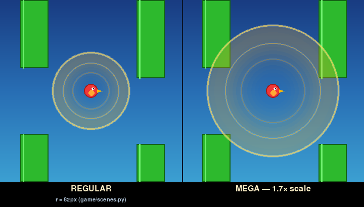
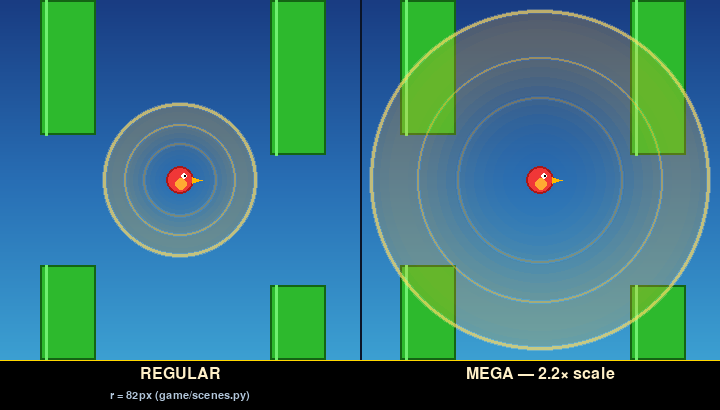
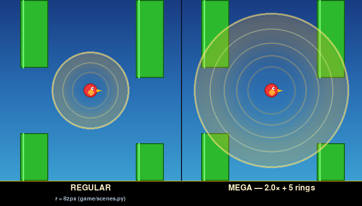
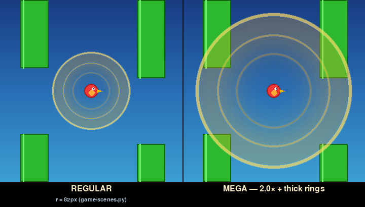
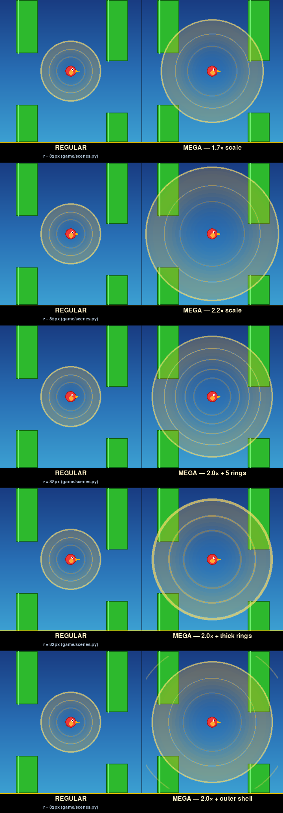

# Mega Magnet — active-field candidates

Five candidate visuals for the Mega Magnet's **active field** (the
aura that pulses around the bird while the powerup is in effect).
Each shown side-by-side with the live regular Magnet field for direct
scale comparison.

The REGULAR cell in every frame is the verbatim renderer from
`game/scenes.py:1032-1085`: 3 nested gold rings + inner radial glow,
all breathing on one pulse, at `MAGNET_RADIUS = 82 px`. The Mega
variants call the same parametric renderer with a bigger `rad` and/or
modified ring stack so the family resemblance is preserved.

Two pillars are shown for in-game scale reference; the bird is
centered in each cell.

## Variants

### V1 — 1.7× scale

Pure scale-up of the regular field. Same 3 rings, same widths, same
palette — just bigger. The most conservative "much larger".

### V2 — 2.2× scale

Same as V1 but more dramatic. Outer ring is now ~180 px radius,
roughly the screen half-width — the field genuinely dominates the
viewport.

### V3 — 2.0× + 5 rings

2× the regular radius but with 5 nested rings instead of 3 (added at
0.84× and 0.36× of the outer). Denser interior — reads as a more
"layered" field.

### V4 — 2.0× + thick rings

2× scale with each ring's stroke width doubled. Same 3-ring layout
but each ring carries more visual weight — beefier read.

### V5 — 2.0× + outer shell

2× scale with an additional faint shell ring out at 1.25× of the
2.0× radius (so the outermost rim is at ~2.5× the regular). Slight
inner glow boost too. The shell suggests the field is "spilling
beyond its main boundary".

## Contact sheet



## Reproducing

```bash
SDL_VIDEODRIVER=dummy SDL_AUDIODRIVER=dummy \
    python tools/render_mega_magnet_effect_candidates.py
```

The renderer reuses the exact ring + glow construction from
`game/scenes.py`, parameterised on radius / ring stack / stroke
width. Picking a variant lets us drop in `rad = MAGNET_RADIUS * N`
(and an optional `rings` override) on the live render path.
