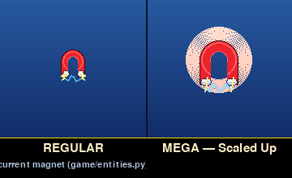
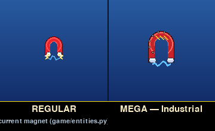
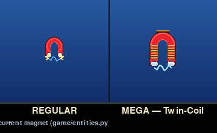
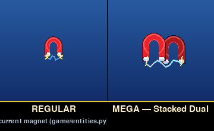
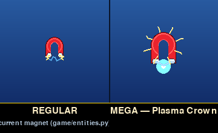

# Mega Magnet — icon candidates

Five candidate icons for the **Mega Magnet** upgrade, each shown
next to the live regular Magnet icon for direct comparison.

The "REGULAR" cell in every comparison is rendered through the real
game code (`PowerUp(kind="magnet").draw()` in `game/entities.py:1364`),
not redrawn — so what you see is exactly what currently spawns in
gameplay. The Mega variant in the right cell uses the same horseshoe
primitives at scaled-up dimensions.

Effect / pickup animation is **not** part of this round — only the
pickup-icon silhouette.

## Variants

Side-by-side (REGULAR | MEGA) on the live sky-mid background colour
(`game/draw.py:SKY_MID = (25, 60, 130)`).

### V1 — Scaled Up

Same horseshoe geometry, 1.7× linear scale, soft warm-orange halo behind.
The simplest "more powerful" read — same idea, bigger field.

### V2 — Industrial

Broader, beefier proportions with a yellow-black hazard stripe across
the arch and six bolt-head studs around the rim. Cast-iron palette
(darker shadow, slightly desaturated red). Reads as "heavy-duty".

### V3 — Twin-Coil

Standard-ish horseshoe with copper coil windings wrapping each leg and
a wire connector arcing over the top. Reads as a real electromagnet —
"this one has windings, the regular one is just a fridge magnet".

### V4 — Stacked Dual

Two horseshoes paired side-by-side (back one darker, offset for depth)
with a single lightning arc spanning all four poles. Reads as
"double magnet = double pull".

### V5 — Plasma Crown

Standard horseshoe with eight crackling lightning bolts radiating
outward from the body and a hot plasma orb suspended between the
poles. Reads as "the field is overflowing".

## Contact sheet


## Reproducing

```bash
SDL_VIDEODRIVER=dummy SDL_AUDIODRIVER=dummy \
    python tools/render_mega_magnet_icon_candidates.py
```

The renderer imports `game.entities.PowerUp` for the regular cell and
reuses the same horseshoe-body / chrome-pole / lightning-arc primitives
for the Mega variants — no PNG sprites.
