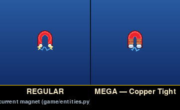
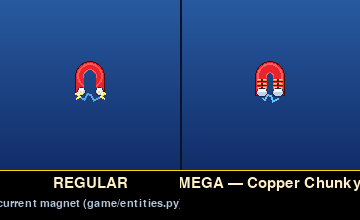
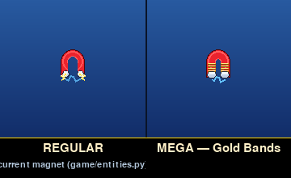
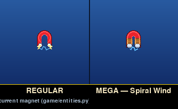
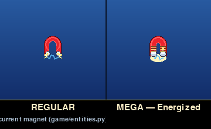
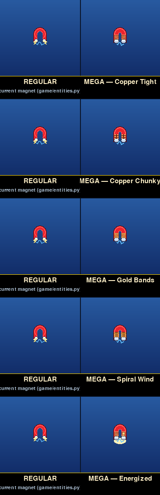

# Mega Magnet — icon candidates (round 2)

Round-2 candidates building on round 1's V3 (Twin-Coil). Direction
locked in for this round:

* Twin-coil silhouette — copper-style windings on each leg
* Overall footprint matched to the regular powerup (same `outer_r`)
* Body arms thicker than the regular magnet (`inner_r` 3 vs 6)
* No wire connector across the top of the arch

Five variations of the coil treatment itself. Effect / pickup
animation still out of scope for this round.

## Variants

Each frame is REGULAR | MEGA. The REGULAR cell is rendered through
the live game code (`PowerUp(kind="magnet").draw()`,
`game/entities.py:1364`).

### V1 — Copper Tight

Eight narrow copper bands tightly stacked on each leg. Reads as
"densely wound electromagnet".

### V2 — Copper Chunky

Three fat copper bands per leg with a dark rivet dot centered in
each band. Industrial / heavy-duty feel.

### V3 — Gold Bands

Same tight-band layout as V1 but in a brighter electroplated-gold
palette. Pops harder against the blue sky background.

### V4 — Spiral Wind

Bands rendered as flat ellipses with a darker back-arc and a brighter
front-arc, so each "wrap" reads as a 3D coil of wire wound around the
leg rather than a stack of flat rings.

### V5 — Energized

V1's copper bands plus a soft amber glow under the legs and a
travelling spark dot that cycles through the bands on the pulse —
signals "current is flowing through the windings".

## Contact sheet



## Reproducing

```bash
SDL_VIDEODRIVER=dummy SDL_AUDIODRIVER=dummy \
    python tools/render_mega_magnet_icon_candidates.py
```
