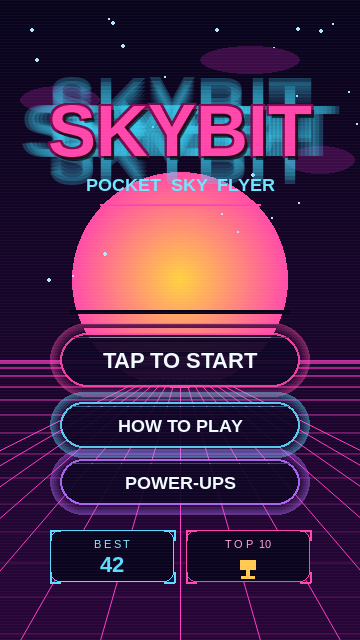
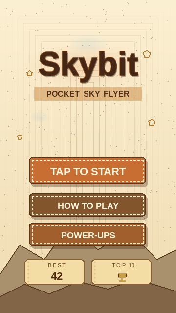
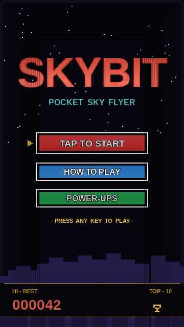
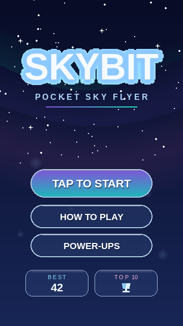
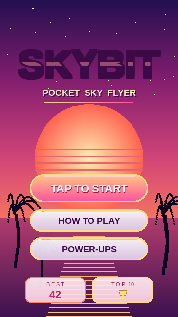

# Skybit v4 — Menu Redesign Themes

Five candidate visual themes for a top-to-bottom menu redesign. Every
mockup is a 360×640 still of the **MAIN MENU** screen, with the exact
same functional layout as v3 — title, TAP TO START, HOW TO PLAY,
POWER-UPS, BEST score, TOP 10 trophy. Only the *visual treatment* changes.

The chosen theme will then be applied consistently across every menu:
main menu, pause overlay, run-summary, game-over, name-entry, leaderboard.

Pick one and I'll implement it on this branch (`v4_skybit_menu_redesign`).

---

## Theme 1 — Neon Arcade (Synthwave / Cyberpunk)

**Vibe:** Late-80s arcade cabinet meets *Drive* soundtrack. Hot pink
neon title with a cyan glow halo, a half-sunk retrowave sun behind a
vanishing-point grid floor, and dark glass pills bordered in pulsing
neon. Subtle scanlines tie the whole thing to a CRT.

**Palette:** electric pink `#FF46AA`, cyan `#6CE0FF`, deep purple
`#240658`, sun-yellow `#FFD23C`.

**Why it works:** Maximum visual energy, instantly says "arcade".
Every pill becomes a light source so the UI feels alive without animation.

**Risks:** Loud, less family-friendly than v3. Heavy palette shift away
from current orange/gold gold-on-red identity.

---

## Theme 2 — Storybook Papercraft

**Vibe:** Warm hand-drawn picture-book / scrapbook. Parchment background
with paper-grain texture, watercolor wash behind the title, doodle stars
and pencil-sketched mountains, washi-tape subtitle strip, and cards with
stitched dashed borders for buttons.

**Palette:** cream `#FCF0D2`, terracotta `#C86E32`, ink-brown `#46261A`,
washi-tape ochre `#DCAA6E`.

**Why it works:** Stands out hard from every other Flappy-clone on the
store — none of them look like a children's book. Casual and inviting.

**Risks:** Loses the "night-flyer" mood. Day-tone parchment may clash
with the in-game night sky unless the gameplay scene also shifts.

---

## Theme 3 — Retro 8-Bit CRT

**Vibe:** NES start-screen authenticity. Pixel title with red-on-black
arcade bevels, chunky 3-color buttons with the classic black-white-color
NES bevel, pixel-stair mountain silhouette, an "HI-BEST 000042" 6-digit
score readout strip at the bottom, and a blinking ▶ cursor showing the
currently-selected button. CRT scanlines + soft vignette baked in.

**Palette:** NES red `#FA5046`, NES blue `#2878C8`, NES green `#28A050`,
arcade-yellow `#FAC83C`, near-black `#06060E`.

**Why it works:** Deeply nostalgic, perfectly genre-appropriate for a
one-button reflex game, and the chunky pixel buttons read big enough
for thumbs.

**Risks:** Will feel like a stylistic *step back* if marketed as "v4 —
new and improved". Best framed as a deliberate retro mode.

---

## Theme 4 — Crystal Aurora (Glassmorphism / Premium)

**Vibe:** Polished premium mobile game (Sky, Alto's Odyssey). Midnight-blue
sky with translucent aurora ribbons (teal → purple → pink), bright
sparkle-stars, floating soft-glow particles, frosted-glass title with a
soft blue halo, true glassmorphism buttons (the primary is a purple→teal
gradient, secondaries are dark frosted glass with light borders), and
glass tiles for BEST / TOP 10.

**Palette:** midnight `#080C26`, aurora-green `#1EF0B4`, aurora-purple
`#8C5AE6`, aurora-pink `#FF5AB4`, ice-white `#F5FAFF`.

**Why it works:** Looks like a $5 app even though it's free. Closest
in mood to v3's night sky — easiest to slot in without changing the
gameplay backdrop. Highest "premium" perception.

**Risks:** Glassmorphism is computationally cheap here (no real blur),
but the look depends on careful gradient work — small palette deviations
read as cheap.

---

## Theme 5 — Tropical Miami Sunset

**Vibe:** Vaporwave/retrowave palm-tree sunset. Vivid orange→pink→purple
sky, full peach sun on the horizon with retrowave horizontal stripes,
reflected sun-bars on the water, palm tree silhouettes flanking the
buttons, and a chrome-pink gradient title with a metallic-strip highlight.
Primary button is hot pink-to-peach with a gold border; secondaries are
soft pearl-pink.

**Palette:** sunset-peach `#FFC882`, hot-pink `#FF5AA0`, indigo
`#240E50`, gold border `#FFDC82`.

**Why it works:** Most "vacation arcade" — high warmth, instantly
appealing thumbnail. Great for App Store featuring.

**Risks:** Title currently reads a little dark against the bright sun
behind it. Would tune the title fill / glow in implementation.

---

## How they all keep v3's functionality

| Element             | Where it lives                      |
|---------------------|-------------------------------------|
| `SKYBIT` title      | Top third, big.                     |
| Subtitle line       | Directly below title.               |
| `TAP TO START`      | Primary pill, centred, ~y=360-380.  |
| `HOW TO PLAY`       | Secondary pill, ~64 px below.       |
| `POWER-UPS`         | Secondary pill, ~120 px below.      |
| `BEST 42`           | Bottom-left tile.                   |
| `TOP 10 🏆`         | Bottom-right tile (clickable).      |
| Mountain silhouette | Bottom backdrop (every theme keeps a horizon). |

Once a theme is chosen, the same language extends to:
* Pause overlay (`PAUSED` title + `TAP·P·ESC` pill)
* Run summary (`RUN SUMMARY` + stat rows)
* Game over (`GAME OVER` + `TAP TO RETRY`)
* Name entry (`SUBMIT` / `SKIP` pair)
* Leaderboard `TOP 10` table
