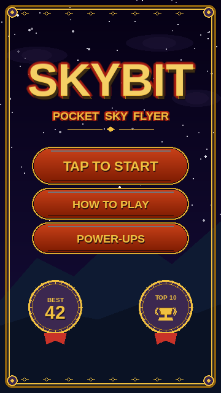
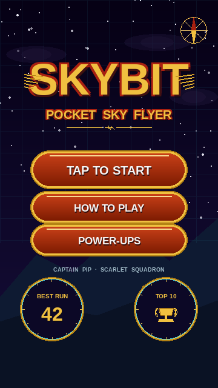
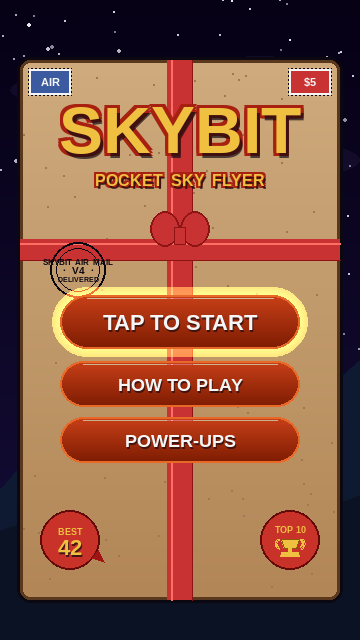
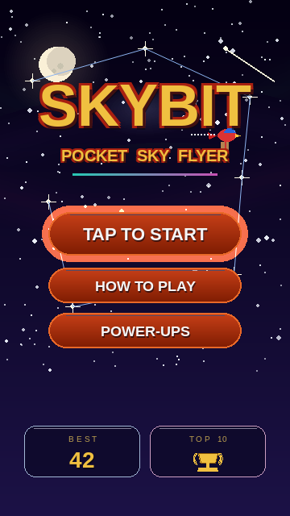
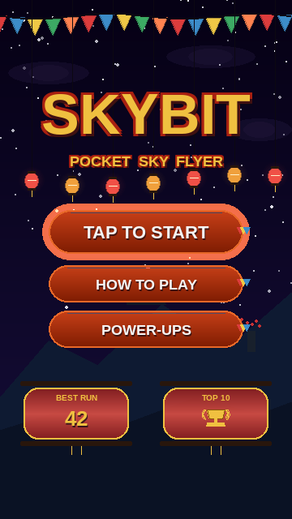

# Skybit v4 — Menu Redesign Candidates

Five **massive upgrades of the original v3 menu**, each pushing one
quality axis hard while preserving Skybit's existing visual identity:

* **Deep navy night-sky** background with stars + mountain silhouettes
* **Gold-on-red outlined `SKYBIT`** title in the canonical recipe
* **Orange-bordered red-gradient pill buttons** (3 stacked)
* **BEST + TOP 10** twin panels at the bottom
* Canonical palette: gold `#F0C040`, red `#A82010`, orange `#E86828`,
  deep purple `#0C0826`, night-deep `#060115`

Every variant uses the bundled Liberation Sans font and only the
existing palette so no new assets are needed. Pick one and I'll roll it
across every menu surface (main, pause, run-summary, game-over,
name-entry, leaderboard).

---

## v1 — ROYAL · Premium Luxury Polish

**The most "App Store featured" look.** The whole menu sits inside a
decorated gold-leaf frame with corner medallions and filigree along
the top and bottom edges. The `SKYBIT` title gains an extra-thick red
outline halo with a dark-gold underlay shadow and a faint top-edge
highlight, giving it a beveled-metal feel. Buttons are pills wrapped
in a **double gold rim** — a thin gold leaf border around each red
pill, with NEAR_BLACK between them so the gold pops. The bottom
panels are **ornate gold medallions** with laurel ticks around the
edge, the BEST value in big bold gold, the TOP 10 medallion holding a
trophy, and both flying tiny red ribbon tails underneath.

* **Best at:** signaling "this is a polished, paid-quality game."
* **Risk:** the frame slightly tightens the playable canvas — the
  inner content area shrinks by ~16 px on every side.

---

## v2 — AVIATOR · Pip's Captain Identity

**Leans into the fact that Pip wears aviator sunglasses and carries
parcels for a living.** A faint navigation map-grid washes the top
half of the sky. A compass rose with a red north needle sits in the
top-right corner. The `SKYBIT` title is flanked by **feathered gold
wings** that flare out like an aviator's pin. A tiny gold airplane
glyph centers the decorative divider line. Buttons become **red
enamel signs mounted on brass plates** with rivet heads on each end —
the panel-style real instruments are mounted with. The bottom panels
are full **brass instrument bezels** — round dials with tick marks,
rivets, and a cyan inner ring (the canonical Skybit accent shifted
slightly to make these read as "gauges"). A `CAPTAIN PIP · SCARLET
SQUADRON` tagline sits between buttons and gauges.

* **Best at:** giving the game a *signature* identity — nobody else
  has aviator parrot couriers.
* **Risk:** the cyan ring on the gauges is the only place this
  variant drifts from the pure gold/orange/red palette. Still in-family.

---

## v3 — PARCEL · The Menu Is a Wrapped Delivery

**Leans into the courier theme — the entire menu is literally a
kraft-tan parcel with a red ribbon cross.** Two postage stamps (`AIR`
in blue, `$5` in red) sit in the top corners. A circular postmark
stamped on the kraft reads `SKYBIT AIR MAIL · V4 · DELIVERED`. A red
ribbon runs vertically down the centre and horizontally across the
middle, meeting in a **puffy bow** above the action buttons. Buttons
sit cleanly below the bow on the kraft. The bottom is dressed with
**red wax-seal panels** for BEST and TOP 10, complete with a tiny
"drip" on the BEST seal and the trophy embossed on TOP 10.

* **Best at:** instant narrative — anyone seeing the title screen
  immediately knows what this game is about.
* **Risk:** the kraft tan does cover most of the night sky. The
  sky-night palette is only visible as a thin border around the parcel.

---

## v4 — STARLIGHT · Massively Enhanced Night Sky

**Closest in DNA to v3 — but pushes the night-sky atmosphere to its
maximum.** Three aurora ribbons (green / purple / pink) flow softly
behind the stars. A **dense starfield** of ~220 stars, plus 7 large
**sparkle stars with cross-flares**, plus **constellation lines**
linking them. A **glowing full moon** with crater shadows sits top-left.
A **shooting star** streaks diagonally top-right. **Pip himself flies
across** behind the title — small but unmistakable, parcel trailing,
motion trail of dots behind him. The title gains a soft cyan glow
halo. The divider line is an aurora-coloured gradient (teal → pink).
The bottom panels are **glassmorphic** — frosted dark panels with
light borders that let the starlight bleed through.

* **Best at:** atmosphere and "premium mobile" polish without changing
  the menu's mood. Safest visual jump for returning players.
* **Risk:** Pip in the background is small; on some screens it might
  read as a decorative element rather than the character.

---

## v5 — FESTIVAL · Prayer Flags & Lantern Garlands

**Leans into the in-game world's Asian-monastery pillar architecture.**
A **prayer-flag bunting** (5-colour pennants: red / blue / yellow /
green / orange) strings across the top of the screen with a slight
sine wave. A **garland of red and orange paper lanterns** drapes just
below the title, each lantern glowing softly. The mountain silhouette
gains a small **lit-window monastery** with its own flag pole, and a
**rowan menhir** with red berries on the right side — both landmarks
the player will recognise from the pillars they fly past. Buttons get
**tiny prayer-flag pennants** clipped to their right ends. The
bottom panels are **twin paper lanterns** with red translucent bodies,
gold rims, dark caps, and gold tassels hanging beneath.

* **Best at:** richest in-world flavor — the menu is decorated with
  things Pip actually flies past in-game.
* **Risk:** the most decorated of the five; could read as "busy" on
  small phone screens. Tunable by lowering the lantern count.

---

## How every functional v3 element maps across the 5 variants

| v3 element | v1 ROYAL | v2 AVIATOR | v3 PARCEL | v4 STARLIGHT | v5 FESTIVAL |
|---|---|---|---|---|---|
| Title | Beveled gold + red halo + frame | Title + gold wings flanking | Stamped on the parcel | Title + glow halo + Pip flying behind | Title under lantern garland |
| Subtitle | Same gold-on-red + diamond divider | Same + airplane glyph divider | Same on kraft | Same + aurora divider | Same |
| TAP TO START | Gold double-rim red pill | Brass-plate enamel sign | Glowing red pill on kraft | Red pill + glow halo | Red pill + flag pennant |
| HOW TO PLAY / POWER-UPS | Smaller gold-rim pills | Smaller brass plates | Smaller pills | Smaller pills | Smaller pills + pennant |
| BEST 42 | Ornate gold medallion + ribbon | Brass instrument bezel | Red wax seal | Glassmorphic frosted panel | Red paper lantern w/ tassel |
| TOP 10 🏆 | Ornate gold medallion + ribbon | Brass instrument bezel | Red wax seal | Glassmorphic frosted panel | Red paper lantern w/ tassel |
| Background | Night sky + gold frame | Night sky + map grid + compass | Night sky around kraft parcel | Aurora + dense stars + moon + shooting star | Night sky + flags + lanterns + monastery + menhir |
| Mountains | Same v3 silhouette | Same v3 silhouette | Hidden behind parcel | Same v3 silhouette | Same + monastery + menhir |

---

## How the chosen variant carries to every menu screen

* **Main menu** — as shown.
* **Pause overlay** — same canvas, dimmed; `PAUSED` title in the same
  treatment as `SKYBIT`.
* **Run summary** — stats rows on whatever the variant's panel style
  is (medallion list / brass dial-card / kraft envelope / glass card /
  lantern row).
* **Game over** — `GAME OVER` title in same treatment; "NEW BEST!"
  burst uses variant-appropriate sparkles (gold filigree for ROYAL,
  shooting stars for STARLIGHT, prayer-flag confetti for FESTIVAL).
* **Name entry** — input field styled to the variant (engraved plate
  for ROYAL, brass nameplate for AVIATOR, address line on parcel for
  PARCEL, glass field for STARLIGHT, prayer-strip for FESTIVAL).
* **TOP 10 leaderboard** — ranked card list using the variant's
  panel style.

Pick one and I'll implement it on `v4_skybit_menu_redesign`.
