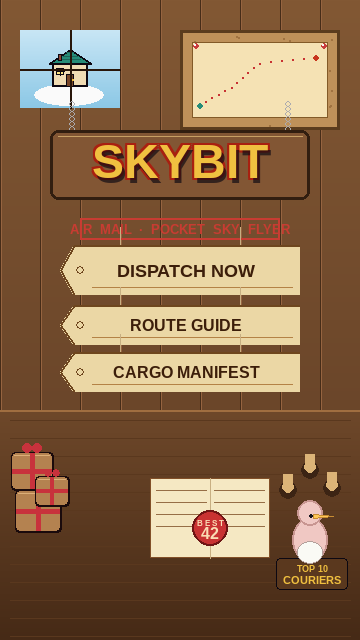
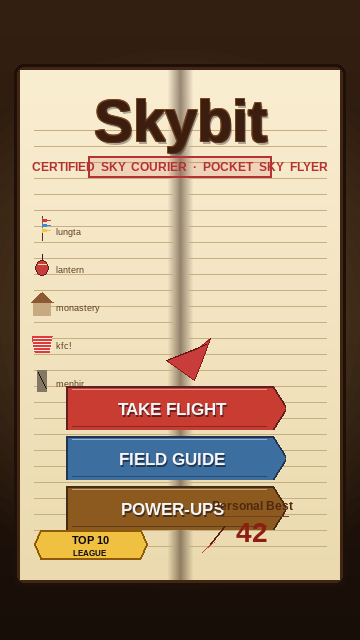
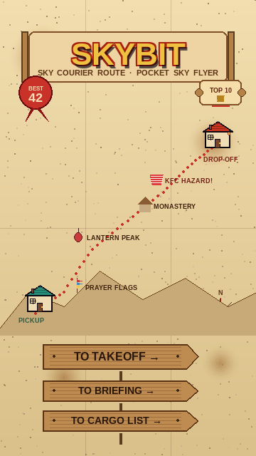
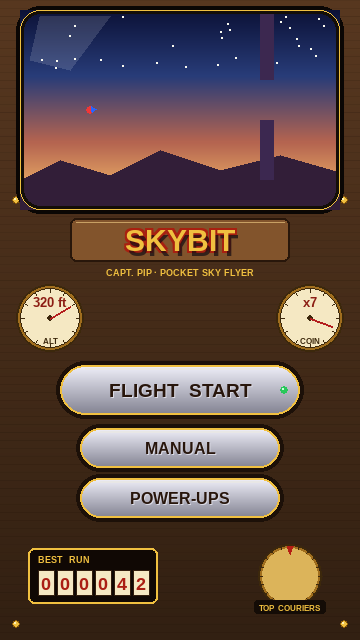
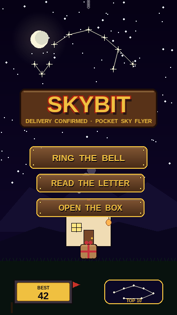

# Skybit v4 — Story-Connected Menu Themes

Round 2 of the menu redesign exploration. The first batch of themes
(neon arcade, papercraft, retro CRT, glassmorphism, retrowave sunset)
was rejected because they were generic visual styles bolted on top
of the game. They had nothing to do with **Pip**, the **parcel**,
**Mr. Garrick**, the cottages, the day-night cycle, or any of the
landmarks the player flies past.

This round fixes that. Every theme is a **moment, place, or artifact
from Pip's delivery journey** — the same world the player already
flies through during a run, just freezing on a different beat of the
story. Together the five themes trace the full delivery cycle:

> 🛖 PICKUP COTTAGE → 📒 PLANNING THE ROUTE → 🗺️ THE MAP → ✈️ THE FLIGHT → 🌙 ARRIVAL

Every mockup is a 360×640 PNG matching the game window. They use
Skybit's canonical UI palette (gold `#F0C040`, red outline `#A82010`,
orange border `#E86828`, deep-purple panel `#0C0826`) and the same
Liberation Sans Bold/Regular font the game already bundles, so the
chosen theme drops into `game/hud.py` without introducing new
dependencies.

Pick one and I'll implement it across every menu surface
(`draw_menu`, `draw_pause_overlay`, `draw_stats`, `draw_gameover`,
`draw_name_entry`, `draw_leaderboard`, plus the in-flight HUD).

---

## Theme A — *The Dispatch Desk* — Mr. Garrick's Post Office

**Story beat:** Where every run begins. Pip is about to pick up the
day's parcel.

You're standing at the counter inside the **teal-roofed pickup
cottage** (`game/intro.py:189-197`). Wood-plank wall behind you, a
window to the left showing a slice of clear sky and the cottage's
own roofline, a cork **pin-board** to the right with the day's
route map pinned up. A wooden sign hung from chains over the desk
reads **SKYBIT** with the subtitle stamped beneath: *AIR MAIL ·
POCKET SKY FLYER*. **Mr. Garrick** (the pelican) peeks in from the
right edge.

* **Buttons** → manila **parcel tags** strung from twine: `DISPATCH NOW` /
  `ROUTE GUIDE` / `CARGO MANIFEST`.
* **BEST** → a red **wax-seal stamp** on the open ledger.
* **TOP 10** → a brass-plaque "TOP COURIERS" trophy on the desk shelf.
* Decorative props: stacked parcels, ink-stamp rack, open ledger.

---

## Theme B — *Pip's Logbook* — The Courier's Journal

**Story beat:** Between flights, Pip journals. The menu *is* his open
diary.

A leather-bound courier's logbook open on a desk, lit by a soft
candle halo. Both cream pages have ruled lines like real notebook
paper. The title **Skybit** is hand-inked at the top; the subtitle is
a faded purple **CERTIFIED SKY COURIER** rubber stamp. Down the left
margin, small ink sketches of the pillar variants Pip has identified
on his routes — **lungta (prayer flags)**, **lantern peak**,
**monastery**, **kfc!** (with a deliberately exclamation-pointed
label), **menhir** — each captioned in his handwriting. A pressed
**red feather** lies across the gutter.

* **Buttons** → tabbed **bookmark ribbons** sticking from the page edge:
  `TAKE FLIGHT` (red) / `FIELD GUIDE` (blue) / `POWER-UPS` (brown).
* **BEST** → "**Personal Best 42**" in cursive ink, with a small
  quill drawn beside.
* **TOP 10** → a gold-foil **LEAGUE** ribbon pressed into the page.

---

## Theme C — *The Cartographer's Chart* — Sky-Route Map

**Story beat:** Planning the route. The full delivery laid out as a
weathered fold-out aerial map.

A tea-stained parchment with fold creases visible. A **scroll banner**
across the top frames the **SKYBIT** title and *SKY COURIER ROUTE*
subtitle. The map field shows pencil-shaded mountains and a **dotted
red flight path** snaking from a **teal pickup-cottage icon** at the
bottom-left to a **red drop-off cottage** at the top-right. Pillar
**landmarks** are dotted along the route with hand-lettered labels —
*PRAYER FLAGS*, *LANTERN PEAK*, *MONASTERY*, *KFC HAZARD!* — same
landmarks Pip will actually fly past during the run. A faint
**compass rose** sits in the corner with a red N arrow.

* **Buttons** → wooden **signposts at a crossroads** pointing forward:
  `TO TAKEOFF →` / `TO BRIEFING →` / `TO CARGO LIST →`.
* **BEST** → a red **wax-seal badge** in the top-left margin.
* **TOP 10** → a tiny **rolled scroll** with a trophy doodle in the
  top-right margin.

---

## Theme D — *The Cockpit Dashboard* — Captain's View

**Story beat:** The flight itself. You are sitting *inside* Pip's
flight harness, looking out.

A vintage instrument panel mounted on polished wood with brass rivets
in the corners. The top third is a **curved-glass windshield** showing
the Skybit twilight sky — stars, deep-blue gradient down to peach
horizon, distant mountain silhouette, and a **tiny incoming pillar
silhouette** on the right (the next obstacle you'd fly through) and
**Pip's tiny scarlet body with blue wing** off in the distance. Below
the windshield a wooden plaque carries the **SKYBIT** title; *CAPT.
PIP · POCKET SKY FLYER* beneath. Two brass **gauges** flank the
plaque: altimeter (320 ft) on the left, coin meter (x7) on the right.

* **Buttons** → chrome push-buttons mounted on the panel, each with
  a brass rim and engraved label: `FLIGHT START` (with green ARMED
  LED) / `MANUAL` / `POWER-UPS`.
* **BEST** → a 6-digit brass **odometer** reading `000042`.
* **TOP 10** → a brass-knurled **radio dial** with a "TOP COURIERS"
  plaque beneath.

This is the only theme where the menu screen visually *shows*
gameplay in the windshield — which is a hook the in-flight HUD can
borrow from later.

---

## Theme E — *Arrival at the Starlit Cottage* — Journey's End

**Story beat:** You made it. The parcel has been delivered. The night
is quiet.

The **red-roofed delivery cottage** (`game/intro.py:442-469`) under a
deep midnight sky, lantern glowing over the door, smoke curling from
the chimney, **the parcel resting on the doorstep with its red bow**.
A constellation in the sky overhead is shaped into a **Pip-and-trophy
silhouette** — a literal celebration in the stars. A full moon glows
softly to the left. The **SKYBIT** title hangs from a wooden plaque
suspended from a chain, *DELIVERY CONFIRMED · POCKET SKY FLYER*
stamped beneath.

* **Buttons** → wood plaques **nailed to the cottage door** with brass
  rims and corner nails: `RING THE BELL` / `READ THE LETTER` /
  `OPEN THE BOX`.
* **BEST** → an engraved **brass mailbox nameplate** at the bottom-left,
  flag raised.
* **TOP 10** → a navy badge with the **constellation pattern**
  recreated in miniature.

The most atmospheric of the five. Closest in mood to v3's existing
night-sky menu, so the smallest visual jump for returning players —
but with the journey wrapped in narrative meaning.

---

## How the same elements map across all five themes

| Functional v3 element | A — Dispatch | B — Logbook | C — Route Map | D — Cockpit | E — Arrival |
|---|---|---|---|---|---|
| `SKYBIT` title | Sign over desk | Ink calligraphy on page | Top scroll banner | Wooden plaque | Plaque on chain |
| Subtitle | Red stamp | Purple stamp | Sub-scroll line | Plaque sub-line | "Delivery confirmed" |
| `TAP TO START` | Parcel tag (DISPATCH NOW) | Red ribbon tab (TAKE FLIGHT) | Wooden signpost (TO TAKEOFF) | Chrome button + LED (FLIGHT START) | Door plaque (RING THE BELL) |
| `HOW TO PLAY` | Parcel tag (ROUTE GUIDE) | Blue ribbon (FIELD GUIDE) | Signpost (TO BRIEFING) | Chrome button (MANUAL) | Door plaque (READ THE LETTER) |
| `POWER-UPS` | Parcel tag (CARGO MANIFEST) | Brown ribbon (POWER-UPS) | Signpost (TO CARGO LIST) | Chrome button (POWER-UPS) | Door plaque (OPEN THE BOX) |
| `BEST 42` | Wax-seal stamp on ledger | "Personal Best" in cursive | Wax-seal badge in margin | 6-digit brass odometer | Mailbox brass plate |
| `TOP 10 🏆` | Brass plaque + trophy | Pressed gold-foil LEAGUE ribbon | Rolled scroll with doodle | Brass radio dial | Constellation badge |
| Background | Wooden post-office interior | Open journal pages | Tea-stained parchment | Polished cockpit panel | Night sky + cottage |
| Recurring characters | Mr. Garrick peeking | Pip's handwriting | Pip's flight path | Pip flying in windshield | Pip's parcel on doorstep |

---

## How the chosen theme will apply game-wide

After you pick one, the same visual language carries to every menu:

* **Main menu** → the chosen theme (as shown).
* **Pause overlay** → same frame, dimmed; `PAUSED` styled like the title.
* **Run summary** → the stats card re-skinned in the theme's
  background (e.g. ink-on-ledger for B, parchment notes for C).
* **Game over** → the theme's "incident" treatment (parcel knocked
  off the desk for A, scribbled-out journal page for B, "ROUTE
  ABORTED" stamp for C, master-alarm red for D, no-arrival
  pre-dawn cottage for E).
* **Name entry** → the theme's input device (ledger sign-in for A,
  journal entry for B, captain's roster for D, mailbox slot for E).
* **TOP 10 leaderboard** → the theme's leaderboard artifact (couriers'
  bulletin for A, league rankings page for B, scroll list for C,
  radio scoreboard for D, constellation hall for E).

Tell me which theme to build out and I'll implement it on
`v4_skybit_menu_redesign`.
