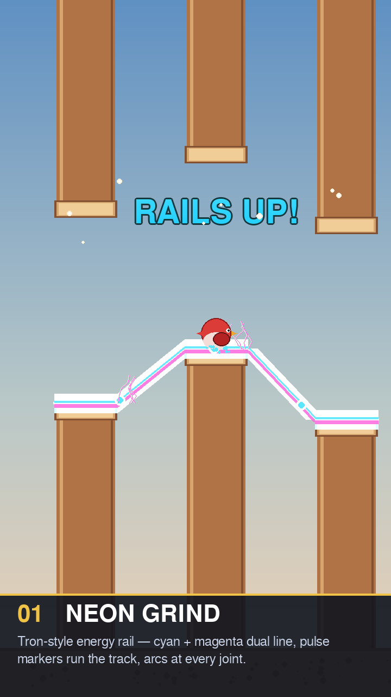
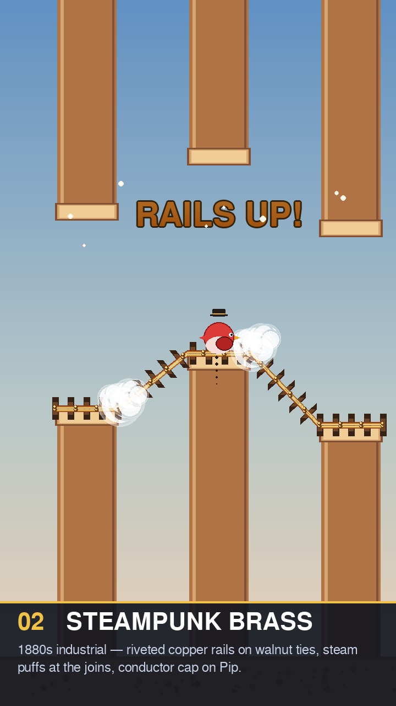
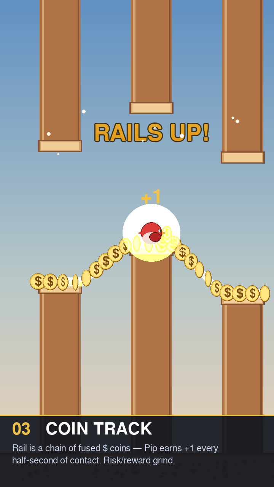
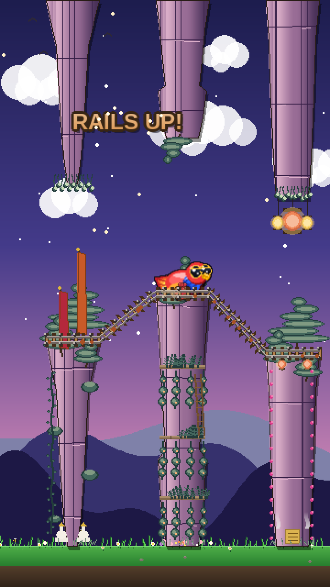
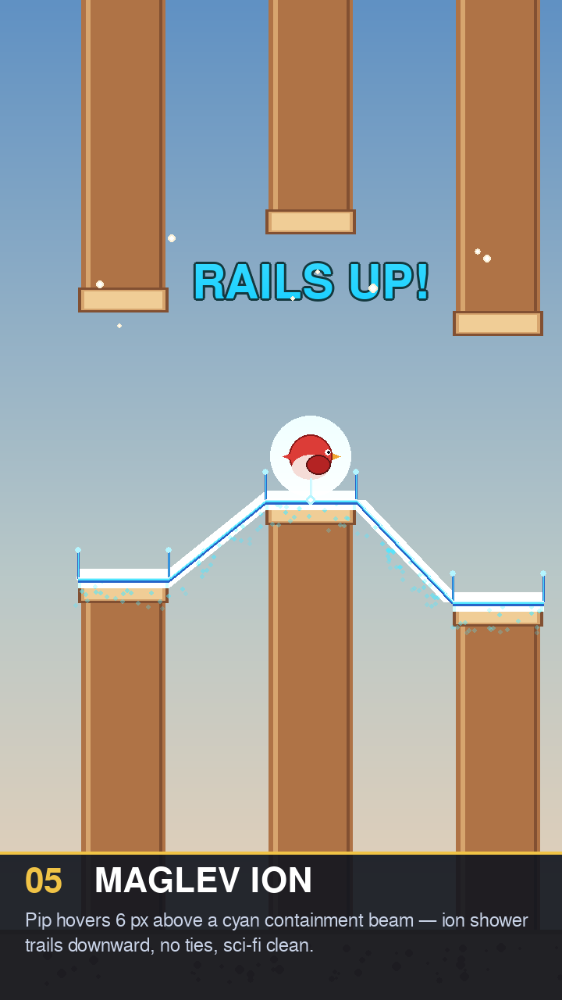

# Railway Power-Up — Visual Design Exploration

Five candidate visual treatments for the **RAILS UP!** power-up (`kind="rail"`
in `game/entities.py:1343`). The *mechanic* isn't changing: a golden
grind-rail spans the next 3 pillar tops, Pip's feet snap onto it, and a flap
releases the lock. What's open is the *look* of that activated rail.

Each mockup renders the same staged scene (3 staggered pillars, Pip mid-grind
on the centre pipe, "RAILS UP!" pickup label floating above) at 2× the
in-game 360×640 canvas so the detail reads clearly.

## How to render

```
pip install pygame
python docs/railway_powerup_design/render_mockups.py
```

Re-runs overwrite the 5 PNGs in this folder.

---

## 01 — Neon Grind



**Tron / Sonic Frontiers energy rail.** Cyan + magenta dual line stacked with
a hot-white core, pulse markers travel along the track, electric arcs jut up
at every joint. Pip's feet kick cyan sparks. Reads as *energy*, not metal.

- **Existing-art hooks:** matches the NIGHTGLOW (cyan, 60,230,230) and
  GHOST (lavender→cyan→mint gradient) palettes — slots cleanly into the
  "supernatural" power-up tier.
- **Risk:** can clash with NIGHTGLOW's biome wash if both are active.
  Worth checking the stacking case.
- **Cheap to ship:** the current `_draw_rail_segment` already uses three
  stacked lines + crossties — swap the colour stops, add a pulse-dot,
  done.

## 02 — Steampunk Brass



**1880s industrial.** Riveted copper rails on dark walnut ties, hissing steam
puffs at every bridge joint, an oil-drip trail. Pip wears a tiny brass-band
conductor cap (head ornament, no full re-skin).

- **Existing-art hooks:** rivets + brass band reuse the same palette as the
  KFC bucket logo and the GROW witch-hat's velvet base (110, 65, 25) →
  (255, 215, 130). Conductor cap is a 24×14 px ornament built like the GROW
  hat — supersample-once + smooth-scale + cache.
- **Risk:** the perpendicular wooden ties are visually noisy. If
  Coin Rush + Rail Track overlap, the chevron coin pattern + ties stack
  awkwardly.
- **Cost:** medium. New `_get_conductor_cap()` cache + per-frame steam
  puff particles tied to bridge midpoints.

## 03 — Coin Track



**The rail itself is a chain of fused gold coins.** Every 0.5 s of contact
peels one coin off the chain and lerps it into Pip — a passive +1 stream
while grinding. Reads as *the track is paying you to ride it*.

- **Existing-art hooks:** the coin sprite is literally
  `_draw_dollar_coin` from `game/dollar_coin_glyphs.py`. The lift-off
  animation reuses the VACUUM coin-lerp pattern from `world.py:1267`.
- **Mechanical implication:** this is the only variant that changes
  scoring, not just visuals. The proof ledger needs a new event kind
  (`"rail_coin"`) so the plausibility check doesn't reject the run for
  having a coin_count mismatch — see `game/_plausibility.py` and the
  VAULT precedent at `world.py:878`.
- **Risk:** richest, but also raises the per-run coin ceiling and may
  need the plausibility ceiling bumped. Confirm before shipping.

## 04 — Western Trestle



**Frontier railroad — weathered timber and iron spikes,** painted on top
of an actual in-game frame (real procedural pillars, real Pip, dusk biome
palette driving the sunset sky). The rail is dull iron with rust patches
and hex-headed spikes, with a sparse dust trail behind Pip's feet.

[Schematic-style mockup](04_western_trestle.png) (matching the other
four) for reference.

- **Existing-art hooks:** dust particles reuse the SKATEBOARD dust palette
  (`(220, 215, 200)` / `(200, 195, 180)`) from `world.py:799`. Sunset wash
  could lean on the existing biome system's dusk phase if active
  (`game/biome.py`) — or stay self-contained.
- **Risk:** the sunset wash overwrites the natural biome cycle for 8 s.
  Either gate the wash so it only activates in day-phase biomes, or
  blend it as a *tint* rather than a fixed amber wash.
- **Cost:** low-medium. Just rail + ties + a per-frame wash surface.

## 05 — Maglev Ion



**Sci-fi levitation.** Pip floats 6 px *above* a cyan containment beam —
this is the only variant that breaks the "feet on rail" silhouette. An
ion-shower trails downward, vertical containment posts stud each pillar
edge, no ties. A tether arc connects Pip's feet to the beam.

- **Existing-art hooks:** containment palette (`(80, 230, 255)` cyan,
  `(180, 245, 255)` hot cyan) matches the NIGHTGLOW power-up exactly —
  these two could share a palette module.
- **Mechanical implication:** the levitation gap means the rail-lock
  height in `world.py:803 _apply_rail_lock` shifts up by 6 px (or the
  bird's `y` is set to `rail_y - br - 6`). Trivial change.
- **Risk:** the no-ties / no-rivets look is the cleanest of the five but
  also the most generic. May not feel as *physical* as 01 or 02. Test
  in motion before committing.

---

## Recommendation

I'd ship **01 Neon Grind** first — cheapest, slots into the existing
"supernatural" power-up tier, and the current rail icon already promises
this aesthetic (it's a 2D gold rail; the activated version going neon-cyan
escalates the read on pickup).

**02 Steampunk Brass** is the strongest *character* variant — it's the
only one that gives Pip a wearable ornament (the conductor cap), which is
the visual hook KFC and GHOST already use. Closest to the existing power-up
language.

**03 Coin Track** is the most mechanically interesting but also the
riskiest — it touches the proof/plausibility layer. Hold for a follow-up
unless we want a designed-for-greed variant.

**04** and **05** are stylistic dead-ends *for this power-up* — Western is
biome-coupled (better as a one-off biome theme), Maglev is too close to
NIGHTGLOW's cyan to read as distinct.

## Inspiration sources

- Sonic grind-rail visual conventions:
  [Sonic Wiki — Grind Rail](https://sonic.fandom.com/wiki/Grind_Rail) and
  [Grinding](https://sonic.fandom.com/wiki/Grinding) (sparks since
  Sonic Adventure 2 / Sonic 06).
- Donkey Kong Country mine-cart railways:
  [Mine Cart Carnage — Mario Wiki](https://www.mariowiki.com/Mine_Cart_Carnage),
  [Donkey Kong Wiki](https://donkeykong.fandom.com/wiki/Mine_Cart_Carnage).
- Subway Surfers hoverboards (trail FX vocabulary):
  [Hoverboard — Subway Surfers Wiki](https://subwaysurf.fandom.com/wiki/Hoverboard).
- Neon UI glow grammar (layered shadow falloff):
  [Free Frontend — 77 CSS Glow Effects](https://freefrontend.com/css-glow-effects/),
  [UI Cookies — 20 Best CSS Glow Effects](https://uicookies.com/css-glow-effects/).
- Steampunk brass / copper railway palette and motifs:
  [Adobe Stock — steampunk train](https://stock.adobe.com/search?k=steampunk+train),
  [Dreamstime — steampunk train illustrations](https://www.dreamstime.com/illustration/steampunk-train).
- Pixel-art train / railway asset traditions:
  [itch.io — pixel art + train games](https://itch.io/games/tag-pixel-art/tag-train).
