# ANIMALS — 20 looks

[← back to the showcase index](README.md)

## In the store

How the **ANIMALS** tab looks in the shop (4 pages):

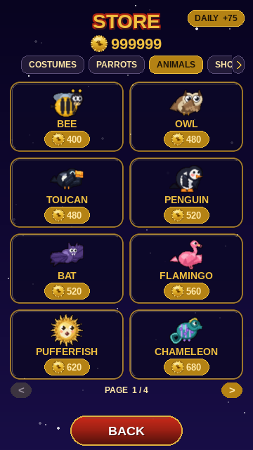
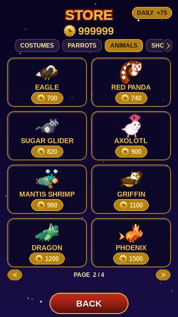
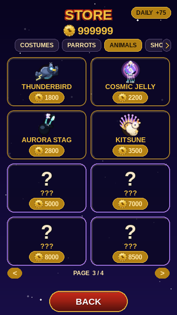
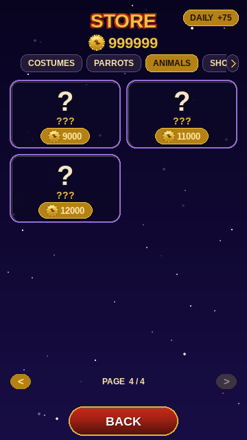

## In gameplay

Pip wearing every item, mid-flight in the same daytime scene (only the cosmetic changes). Click any frame for the full screen.

<table>
  <tr>
    <td align="center" valign="top"><a href="img/play_skin_bee_full.png">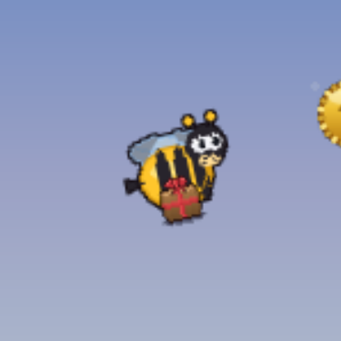</a> <b>BEE</b> 400</td>
    <td align="center" valign="top"><a href="img/play_skin_owl_full.png">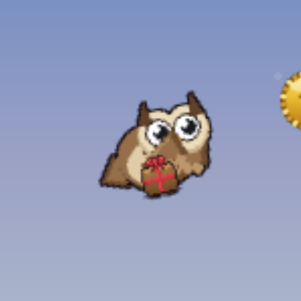</a> <b>OWL</b> 480</td>
    <td align="center" valign="top"><a href="img/play_skin_toucan_full.png">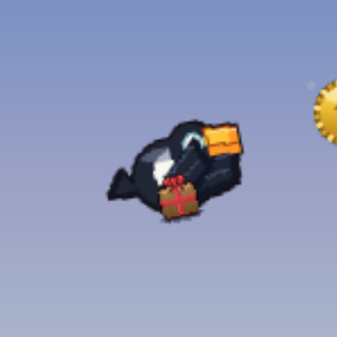</a> <b>TOUCAN</b> 480</td>
    <td align="center" valign="top"><a href="img/play_skin_penguin_full.png">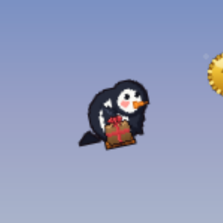</a> <b>PENGUIN</b> 520</td>
  </tr>
  <tr>
    <td align="center" valign="top"><a href="img/play_skin_bat_full.png">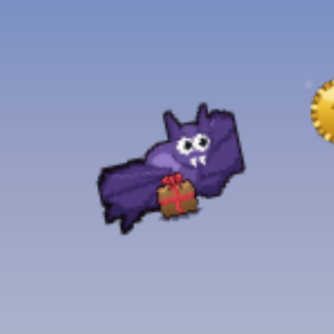</a> <b>BAT</b> 520</td>
    <td align="center" valign="top"><a href="img/play_skin_flamingo_full.png">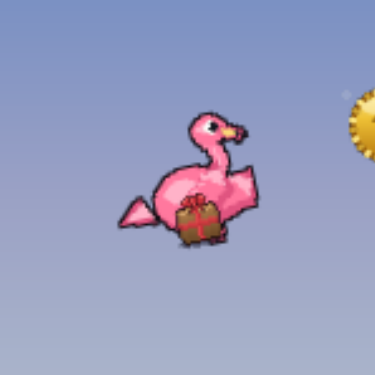</a> <b>FLAMINGO</b> 560</td>
    <td align="center" valign="top"><a href="img/play_skin_pufferfish_full.png">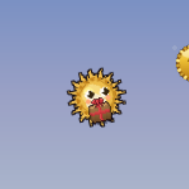</a> <b>PUFFERFISH</b> 620</td>
    <td align="center" valign="top"><a href="img/play_skin_chameleon_full.png">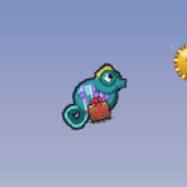</a> <b>CHAMELEON</b> 680</td>
  </tr>
  <tr>
    <td align="center" valign="top"><a href="img/play_skin_eagle_full.png">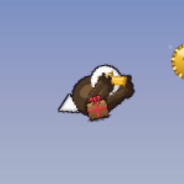</a> <b>EAGLE</b> 700</td>
    <td align="center" valign="top"><a href="img/play_skin_red_panda_full.png">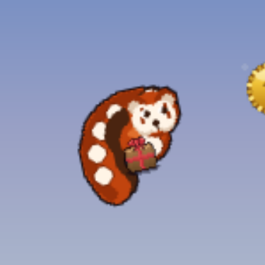</a> <b>RED PANDA</b> 740</td>
    <td align="center" valign="top"><a href="img/play_skin_sugar_glider_full.png">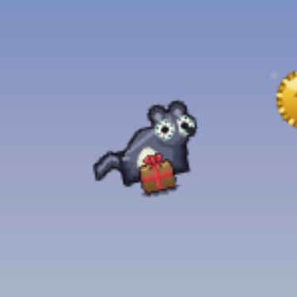</a> <b>SUGAR GLIDER</b> 820</td>
    <td align="center" valign="top"><a href="img/play_skin_axolotl_full.png">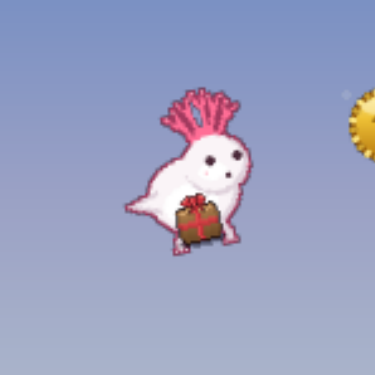</a> <b>AXOLOTL</b> 900</td>
  </tr>
  <tr>
    <td align="center" valign="top"><a href="img/play_skin_mantis_shrimp_full.png">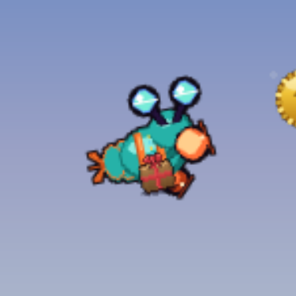</a> <b>MANTIS SHRIMP</b> 980</td>
    <td align="center" valign="top"><a href="img/play_skin_griffin_full.png">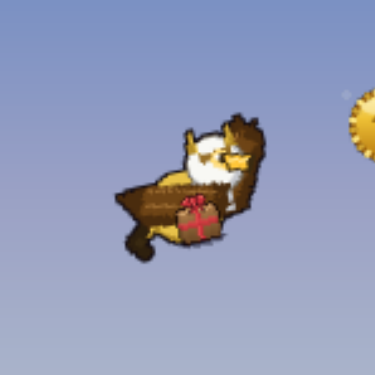</a> <b>GRIFFIN</b> 1100</td>
    <td align="center" valign="top"><a href="img/play_skin_dragon_full.png">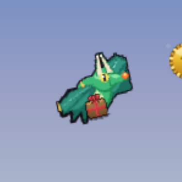</a> <b>DRAGON</b> 1200</td>
    <td align="center" valign="top"><a href="img/play_skin_phoenix_full.png">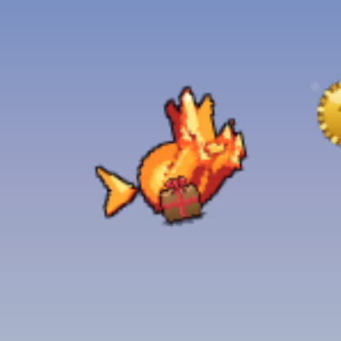</a> <b>PHOENIX</b> 1500</td>
  </tr>
  <tr>
    <td align="center" valign="top"><a href="img/play_skin_thunderbird_full.png">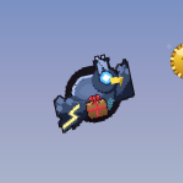</a> <b>THUNDERBIRD</b> 1800</td>
    <td align="center" valign="top"><a href="img/play_skin_cosmic_jelly_full.png">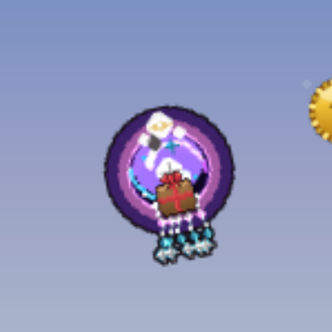</a> <b>COSMIC JELLY</b> 2200</td>
    <td align="center" valign="top"><a href="img/play_skin_aurora_stag_full.png">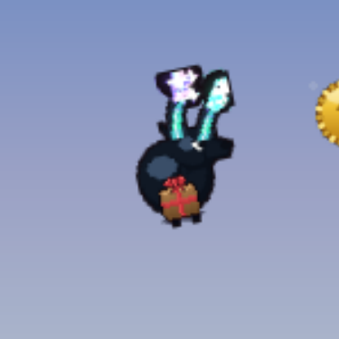</a> <b>AURORA STAG</b> 2800</td>
    <td align="center" valign="top"><a href="img/play_skin_kitsune_full.png">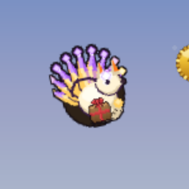</a> <b>KITSUNE</b> 3500</td>
  </tr>
</table>
