# COSTUMES — 15 looks

[← back to the showcase index](README.md)

## In the store

How the **COSTUMES** tab looks in the shop (3 pages):

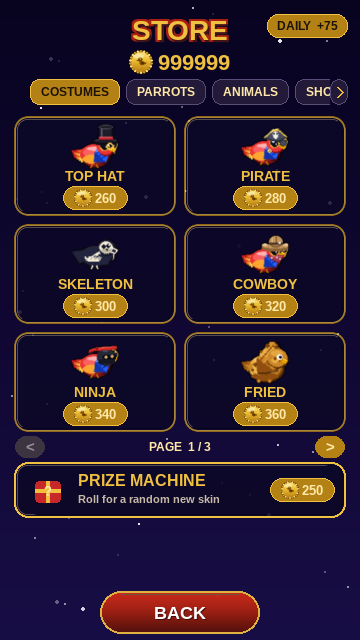
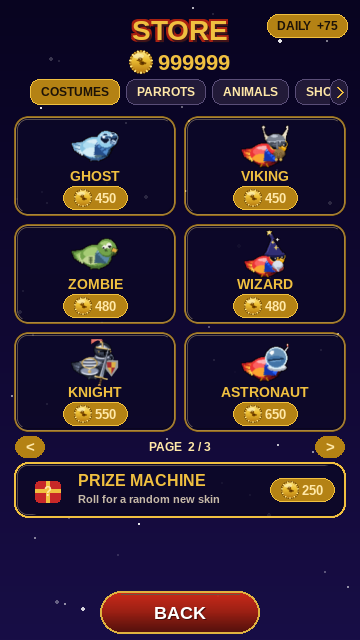
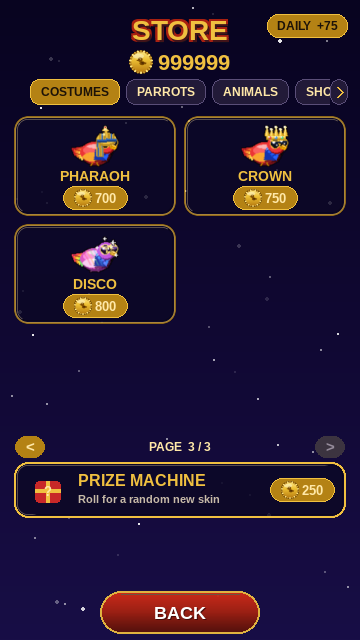

## In gameplay

Pip wearing every item, mid-flight in the same daytime scene (only the cosmetic changes). Click any frame for the full screen.

<table>
  <tr>
    <td align="center" valign="top"><a href="img/play_skin_tophat_full.png">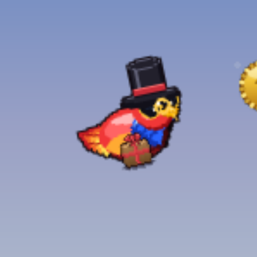</a> <b>TOP HAT</b> 260</td>
    <td align="center" valign="top"><a href="img/play_skin_pirate_full.png">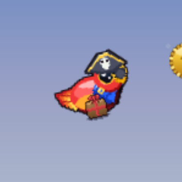</a> <b>PIRATE</b> 280</td>
    <td align="center" valign="top"><a href="img/play_skin_skeleton_full.png">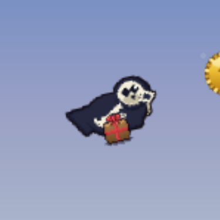</a> <b>SKELETON</b> 300</td>
    <td align="center" valign="top"><a href="img/play_skin_cowboy_full.png">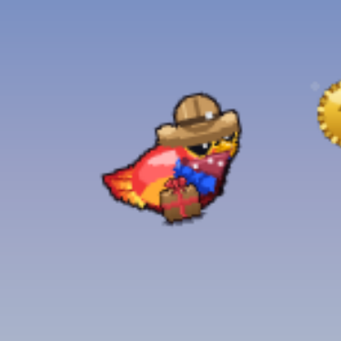</a> <b>COWBOY</b> 320</td>
  </tr>
  <tr>
    <td align="center" valign="top"><a href="img/play_skin_ninja_full.png">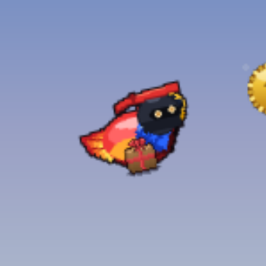</a> <b>NINJA</b> 340</td>
    <td align="center" valign="top"><a href="img/play_skin_kfc_full.png">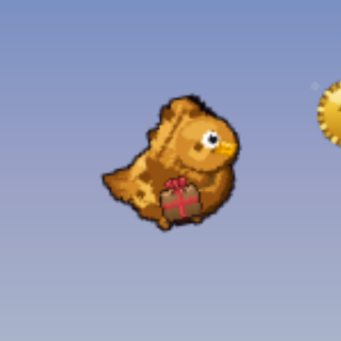</a> <b>FRIED</b> 360</td>
    <td align="center" valign="top"><a href="img/play_skin_ghost_full.png">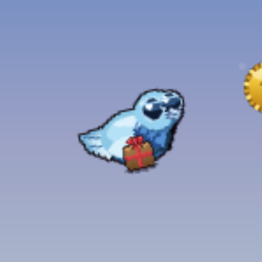</a> <b>GHOST</b> 450</td>
    <td align="center" valign="top"><a href="img/play_skin_viking_full.png">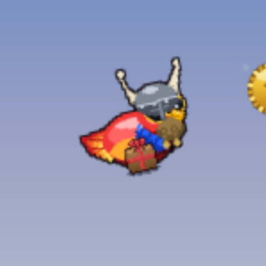</a> <b>VIKING</b> 450</td>
  </tr>
  <tr>
    <td align="center" valign="top"><a href="img/play_skin_zombie_full.png">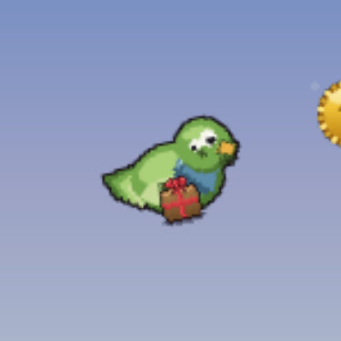</a> <b>ZOMBIE</b> 480</td>
    <td align="center" valign="top"><a href="img/play_skin_wizard_full.png">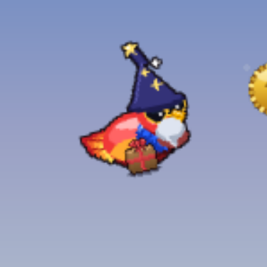</a> <b>WIZARD</b> 480</td>
    <td align="center" valign="top"><a href="img/play_skin_knight_full.png">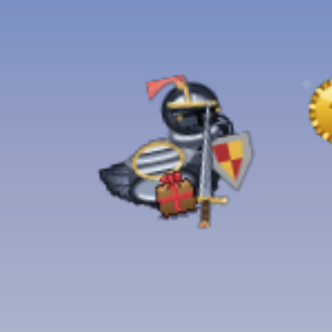</a> <b>KNIGHT</b> 550</td>
    <td align="center" valign="top"><a href="img/play_skin_astronaut_full.png">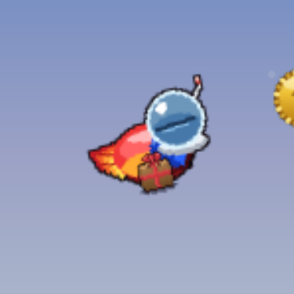</a> <b>ASTRONAUT</b> 650</td>
  </tr>
  <tr>
    <td align="center" valign="top"><a href="img/play_skin_pharaoh_full.png">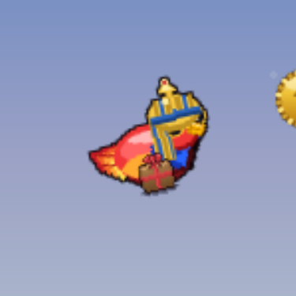</a> <b>PHARAOH</b> 700</td>
    <td align="center" valign="top"><a href="img/play_skin_crown_full.png">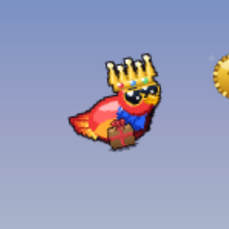</a> <b>CROWN</b> 750</td>
    <td align="center" valign="top"><a href="img/play_skin_disco_full.png">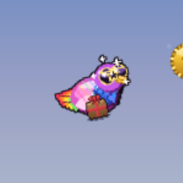</a> <b>DISCO</b> 800</td>
  </tr>
</table>
