# HATS — 16 looks

[← back to the showcase index](README.md)

## In the store

How the **HATS** tab looks in the shop (3 pages):

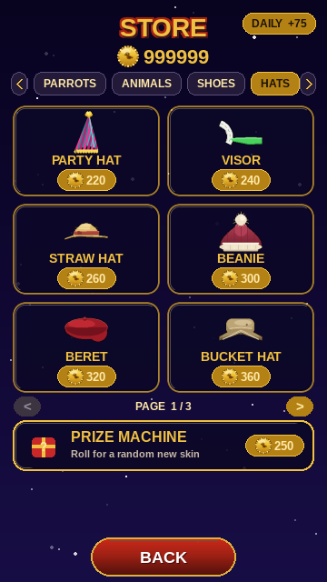
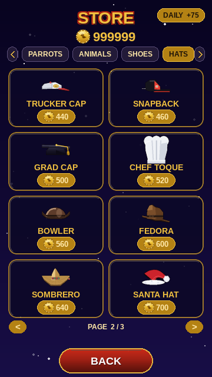
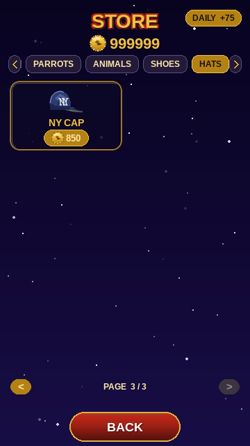

## In gameplay

Pip wearing every item, mid-flight in the same daytime scene (only the cosmetic changes). Click any frame for the full screen.

<table>
  <tr>
    <td align="center" valign="top"><a href="img/play_skin_hat_partyhat_full.png">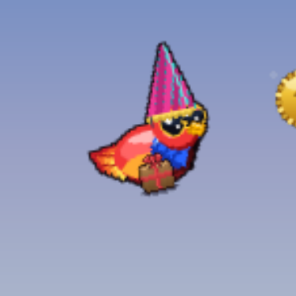</a> <b>PARTY HAT</b> 220</td>
    <td align="center" valign="top"><a href="img/play_skin_hat_strawhat_full.png">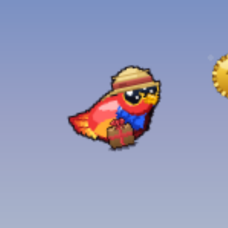</a> <b>STRAW HAT</b> 260</td>
    <td align="center" valign="top"><a href="img/play_skin_hat_beanie_full.png">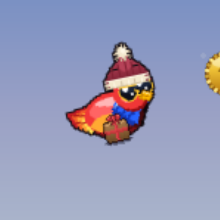</a> <b>BEANIE</b> 300</td>
    <td align="center" valign="top"><a href="img/play_skin_hat_beret_full.png">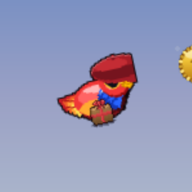</a> <b>BERET</b> 320</td>
  </tr>
  <tr>
    <td align="center" valign="top"><a href="img/play_skin_hat_buckethat_full.png">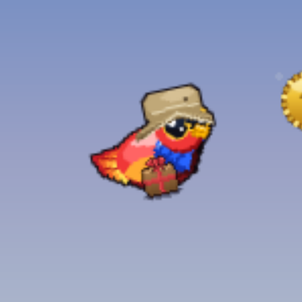</a> <b>BUCKET HAT</b> 360</td>
    <td align="center" valign="top"><a href="img/play_skin_hat_flatcap_full.png">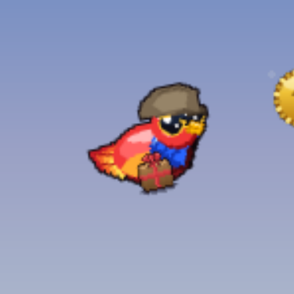</a> <b>FLAT CAP</b> 380</td>
    <td align="center" valign="top"><a href="img/play_skin_hat_propeller_full.png">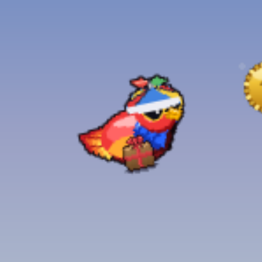</a> <b>PROPELLER CAP</b> 420</td>
    <td align="center" valign="top"><a href="img/play_skin_hat_trucker_full.png">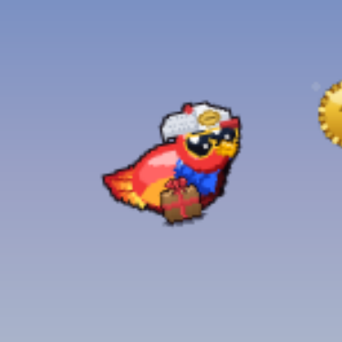</a> <b>TRUCKER CAP</b> 440</td>
  </tr>
  <tr>
    <td align="center" valign="top"><a href="img/play_skin_hat_snapback_full.png">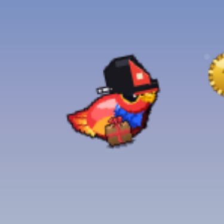</a> <b>SNAPBACK</b> 460</td>
    <td align="center" valign="top"><a href="img/play_skin_hat_gradcap_full.png">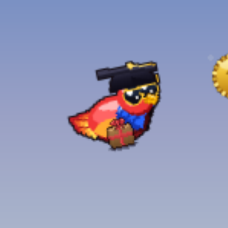</a> <b>GRAD CAP</b> 500</td>
    <td align="center" valign="top"> <b>CHEF TOQUE</b> 520</td>
    <td align="center" valign="top"><a href="img/play_skin_hat_bowler_full.png">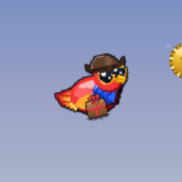</a> <b>BOWLER</b> 560</td>
  </tr>
  <tr>
    <td align="center" valign="top"><a href="img/play_skin_hat_fedora_full.png">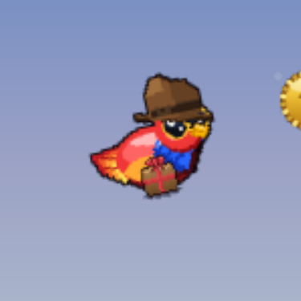</a> <b>FEDORA</b> 600</td>
    <td align="center" valign="top"><a href="img/play_skin_hat_sombrero_full.png">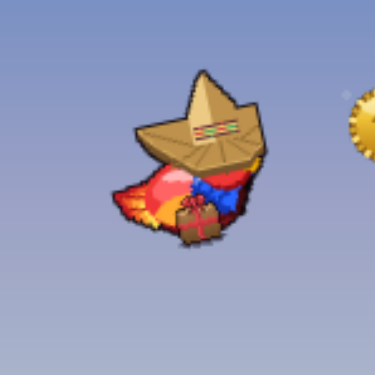</a> <b>SOMBRERO</b> 640</td>
    <td align="center" valign="top"><a href="img/play_skin_hat_santa_full.png">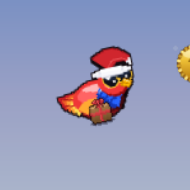</a> <b>SANTA HAT</b> 700</td>
    <td align="center" valign="top"><a href="img/play_skin_hat_nycap_full.png">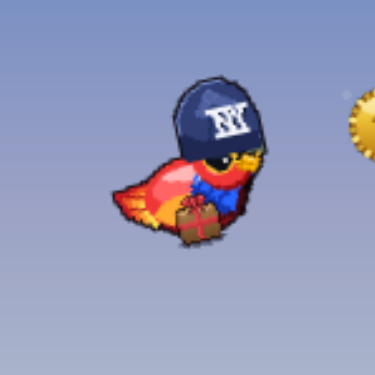</a> <b>NY CAP</b> 850</td>
  </tr>
</table>
