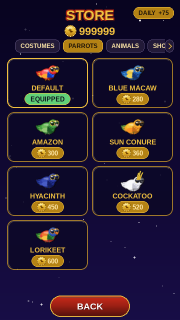
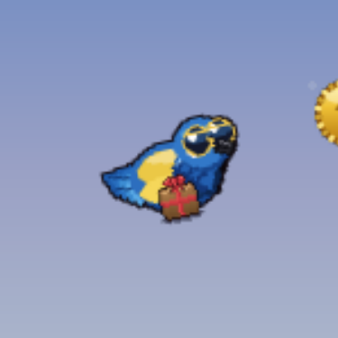
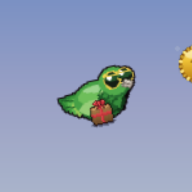
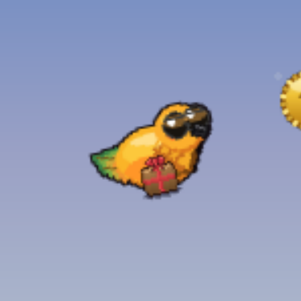
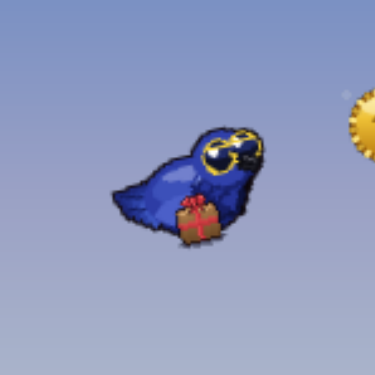
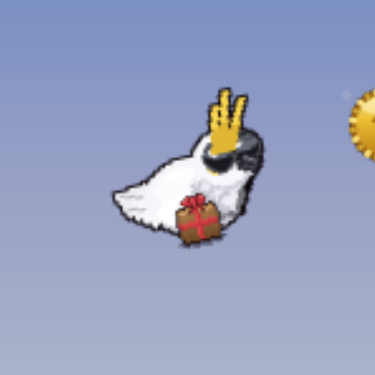
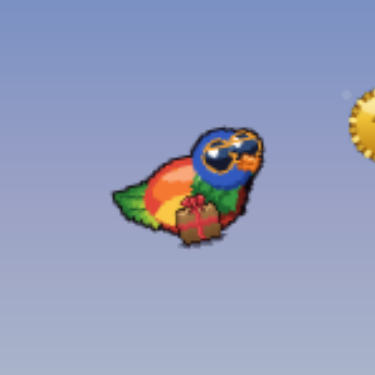

# PARROTS — 7 looks

[← back to the showcase index](README.md)

## In the store

How the **PARROTS** tab looks in the shop:

## In gameplay

Pip wearing every item, mid-flight in the same daytime scene (only the cosmetic changes). Click any frame for the full screen.

<table>
  <tr>
    <td align="center" valign="top"> <b>DEFAULT</b> FREE</td>
    <td align="center" valign="top"> <b>BLUE MACAW</b> 280</td>
    <td align="center" valign="top"> <b>AMAZON</b> 300</td>
    <td align="center" valign="top"> <b>SUN CONURE</b> 360</td>
  </tr>
  <tr>
    <td align="center" valign="top"> <b>HYACINTH</b> 450</td>
    <td align="center" valign="top"> <b>COCKATOO</b> 520</td>
    <td align="center" valign="top"> <b>LORIKEET</b> 600</td>
  </tr>
</table>
