# SHADES — 13 looks

[← back to the showcase index](README.md)

## In the store

How the **SHADES** tab looks in the shop (3 pages):

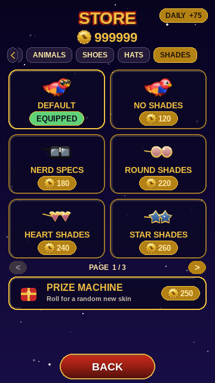
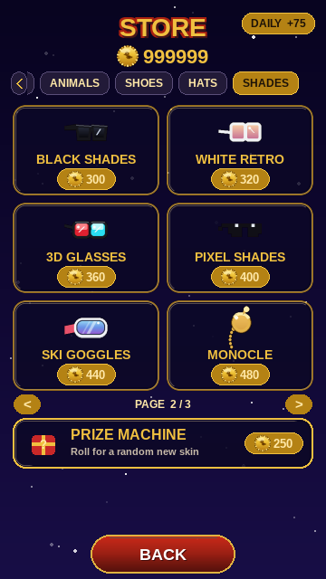
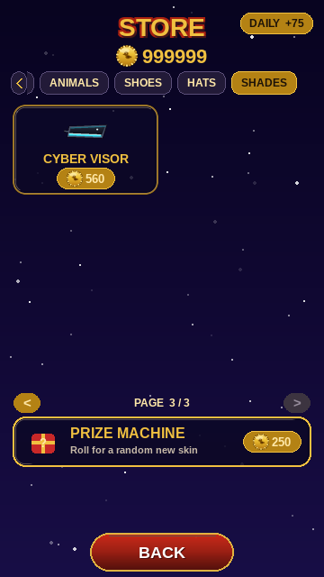

## In gameplay

Pip wearing every item, mid-flight in the same daytime scene (only the cosmetic changes). Click any frame for the full screen.

<table>
  <tr>
    <td align="center" valign="top"> <b>DEFAULT</b> FREE</td>
    <td align="center" valign="top"><a href="img/play_skin_shades_none_full.png">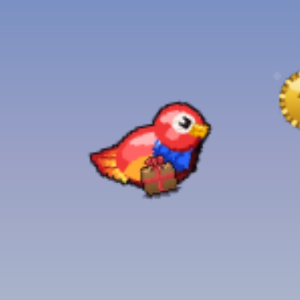</a> <b>NO SHADES</b> 120</td>
    <td align="center" valign="top"><a href="img/play_skin_shades_nerd_full.png">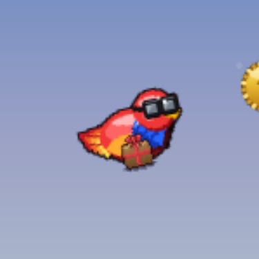</a> <b>NERD SPECS</b> 180</td>
    <td align="center" valign="top"><a href="img/play_skin_shades_round_full.png">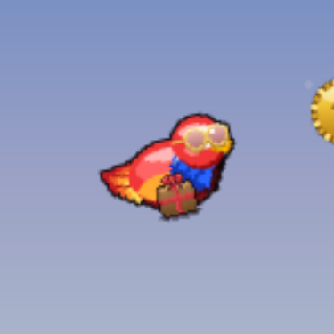</a> <b>ROUND SHADES</b> 220</td>
  </tr>
  <tr>
    <td align="center" valign="top"> <b>HEART SHADES</b> 240</td>
    <td align="center" valign="top"><a href="img/play_skin_shades_star_full.png">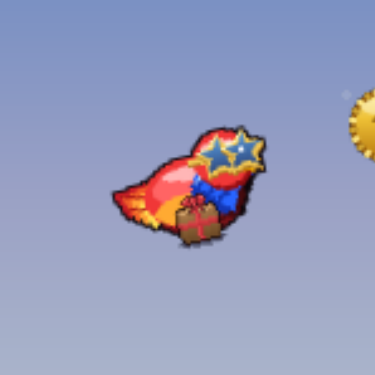</a> <b>STAR SHADES</b> 260</td>
    <td align="center" valign="top"><a href="img/play_skin_shades_black_full.png">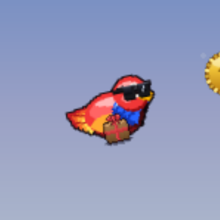</a> <b>BLACK SHADES</b> 300</td>
    <td align="center" valign="top"><a href="img/play_skin_shades_white_full.png">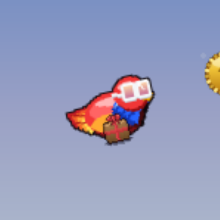</a> <b>WHITE RETRO</b> 320</td>
  </tr>
  <tr>
    <td align="center" valign="top"> <b>3D GLASSES</b> 360</td>
    <td align="center" valign="top"><a href="img/play_skin_shades_pixel_full.png">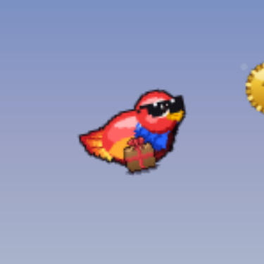</a> <b>PIXEL SHADES</b> 400</td>
    <td align="center" valign="top"><a href="img/play_skin_shades_ski_full.png">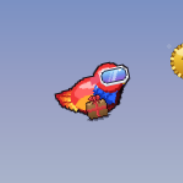</a> <b>SKI GOGGLES</b> 440</td>
    <td align="center" valign="top"><a href="img/play_skin_shades_monocle_full.png">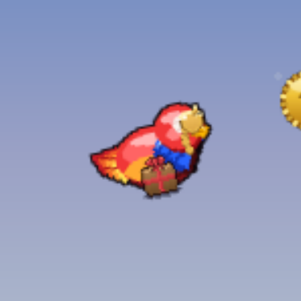</a> <b>MONOCLE</b> 480</td>
  </tr>
  <tr>
    <td align="center" valign="top"> <b>CYBER VISOR</b> 560</td>
  </tr>
</table>
