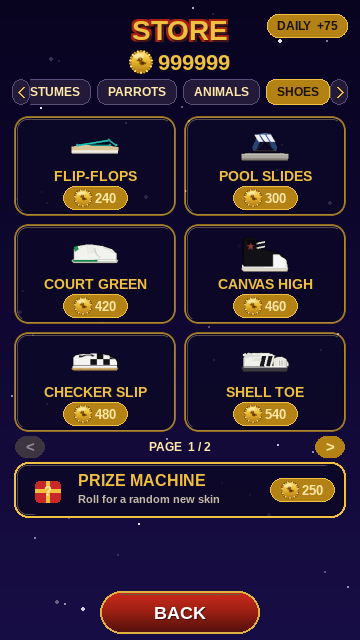
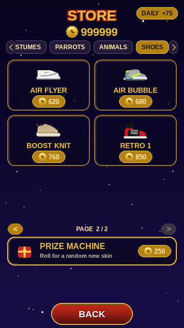
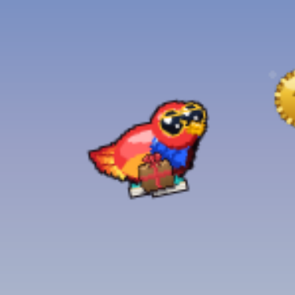
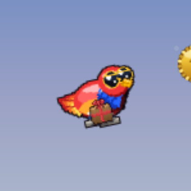
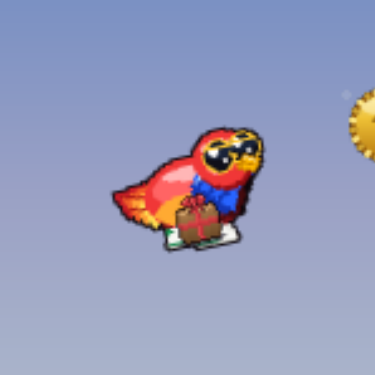
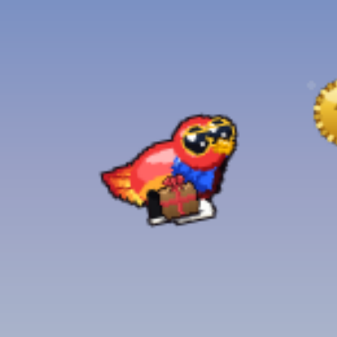
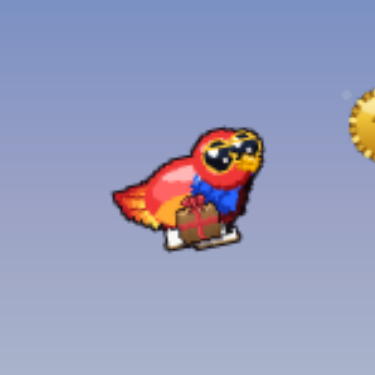
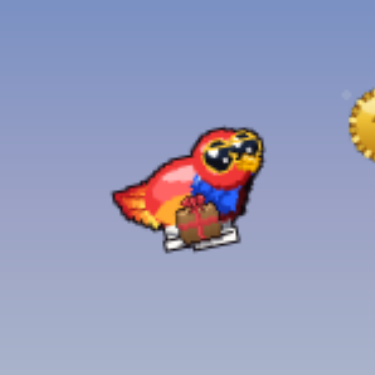
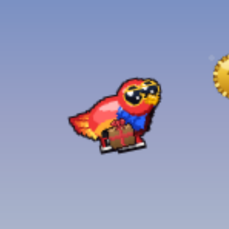

# SHOES — 10 looks

[← back to the showcase index](README.md)

## In the store

How the **SHOES** tab looks in the shop (2 pages):

## In gameplay

Pip wearing every item, mid-flight in the same daytime scene (only the cosmetic changes). Click any frame for the full screen.

<table>
  <tr>
    <td align="center" valign="top"> <b>FLIP-FLOPS</b> 240</td>
    <td align="center" valign="top"> <b>POOL SLIDES</b> 300</td>
    <td align="center" valign="top"> <b>COURT GREEN</b> 420</td>
    <td align="center" valign="top"> <b>CANVAS HIGH</b> 460</td>
  </tr>
  <tr>
    <td align="center" valign="top"> <b>CHECKER SLIP</b> 480</td>
    <td align="center" valign="top"> <b>SHELL TOE</b> 540</td>
    <td align="center" valign="top"> <b>AIR FLYER</b> 620</td>
    <td align="center" valign="top"> <b>AIR BUBBLE</b> 680</td>
  </tr>
  <tr>
    <td align="center" valign="top"> <b>BOOST KNIT</b> 760</td>
    <td align="center" valign="top"> <b>RETRO 1</b> 850</td>
  </tr>
</table>
