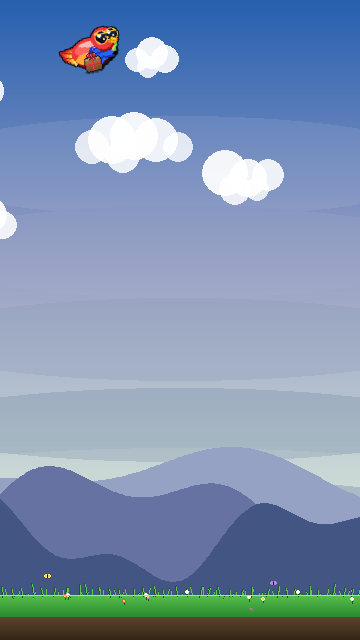
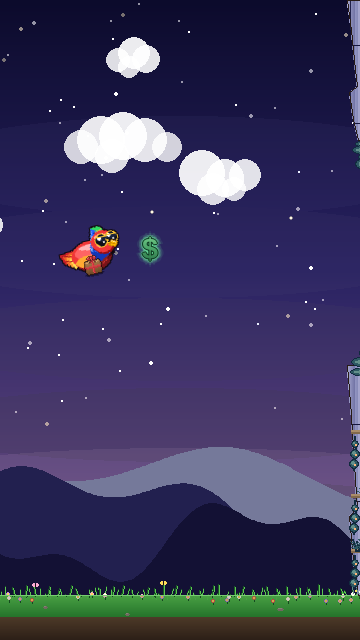
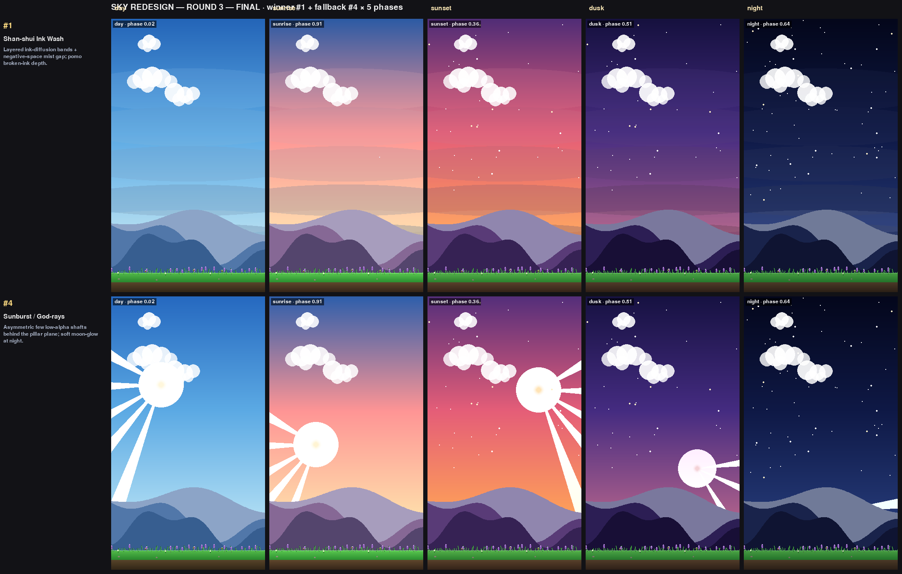
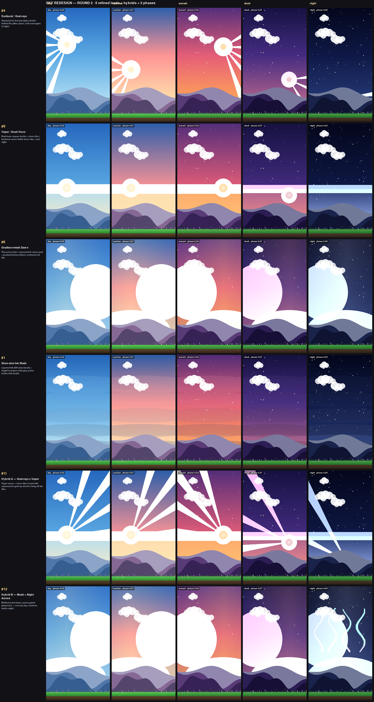
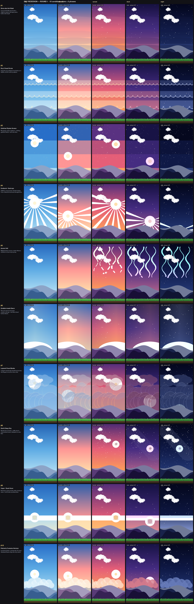

# Sky / Biome Redesign — Shan-shui Ink Wash

The sky was the one visual never upgraded since early development: a flat 4-stop
vertical gradient (sky_top → sky_mid → sky_bot → horizon) that read as "a gradual
PowerPoint presentation." This redesign brings it up to the branch's East-Asian
ink / shan-shui art direction (the same lineage as the Ruyi clouds and
pagoda-crowned ridges), holding across all 7 times of day.

Run through the project design loop: **graphics-designer** produces candidate
sheets, **art-director** critiques and ranks, repeat (max 3 rounds). Final
verdict was **SHIP-READY** on the Shan-shui Ink Wash.

## Final result — live in-game

The chosen design integrated into `game/draw.py:get_sky_surface_biome`, rendered
through the real `_draw_background` path:

| Day | Night |
| --- | --- |
|  |  |

## Round 3 — final (winner + fallback × 5 phases)

Top row: **#1 Shan-shui Ink Wash** (winner / integration target). Bottom row:
**#4 God-rays** (fallback). Columns: day · sunrise · sunset · dusk · night.

## Round 2 — 6 refined leads + 2 hybrids

## Round 1 — 10 candidate directions × 5 times of day

Rows: Shan-shui Ink Wash · Ruyi Cloud Strata · Gold-leaf Byōbu Screen ·
Sunburst/God-rays · Aurora Veil · Gradient-mesh Dawn · Layered Cloud Banks ·
Starlit Deep Sky · Vapor/Dusk Haze · Painterly Cumulus Horizon.

## Why Shan-shui won

- **Identity-true** — layered ink-diffusion bands match the shan-shui mountains
  and Ruyi clouds the branch already ships.
- **Value-led, not hue-dependent** — a carved bright "mist gap" stays the
  highest value in the frame at every phase (verified by luminance measurement,
  incl. the tricky sunset), so the ridgeline reads crisply and the HUD zone
  stays calm. Accessible and colorblind-safe.
- **Cross-fade safe** — disc-free and driven entirely by the already-interpolated
  biome palette (no hard phase thresholds), so the per-bucket sky cache
  cross-fades between adjacent times of day without a value pop, and with no
  double-disc ghosting.

The 10 candidate render functions live in `archive/sky_redesign/` as the
historical record; the God-rays fallback is kept there if more "juice" is ever
wanted over the calm ink wash.
