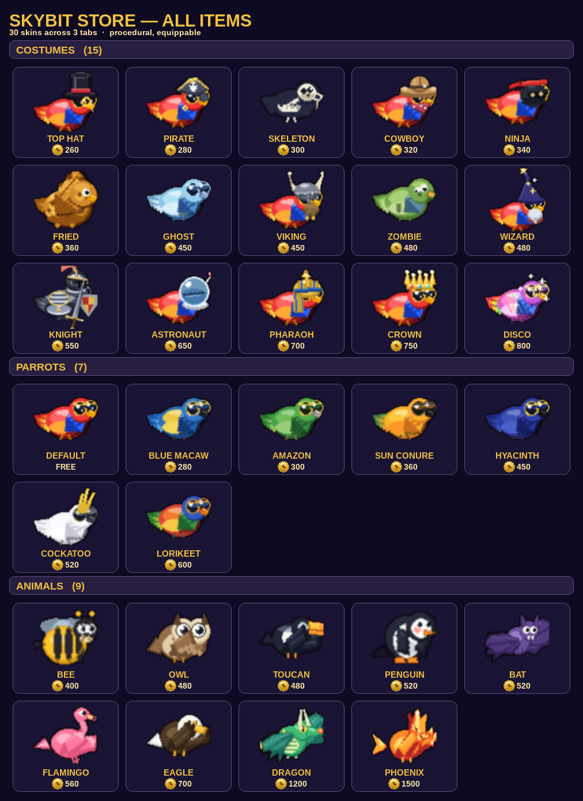

# Skybit Store — all items

Every cosmetic in the coin Store, in one figure: **30 equippable skins** plus the
free **DEFAULT** macaw, grouped by the store's tabs (COSTUMES / PARROTS /
ANIMALS) with each item's name and coin cost. All art is procedural (drawn from
code) and animates over the bird's 4 wing frames.



Regenerate after adding skins:

```sh
SDL_VIDEODRIVER=dummy python docs/store/render_gallery.py
```

The roster is data-driven: each item is a catalog entry in
[`game/store_catalog.py`](../../game/store_catalog.py) plus a procedural builder
in [`game/store_skins.py`](../../game/store_skins.py) (costumes + parrot species)
or [`game/animal_skins.py`](../../game/animal_skins.py) (animals), dispatched by
`parrot.get_skin_frame`. Design-loop records live in
[`docs/store_skins/`](../store_skins) and [`docs/creatures/`](../creatures).
